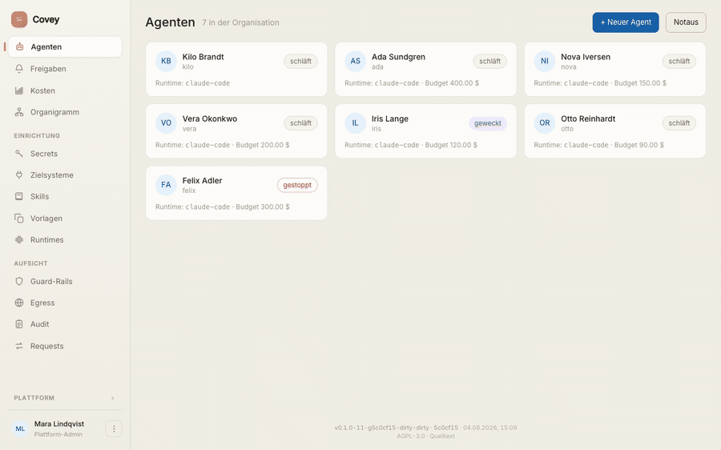
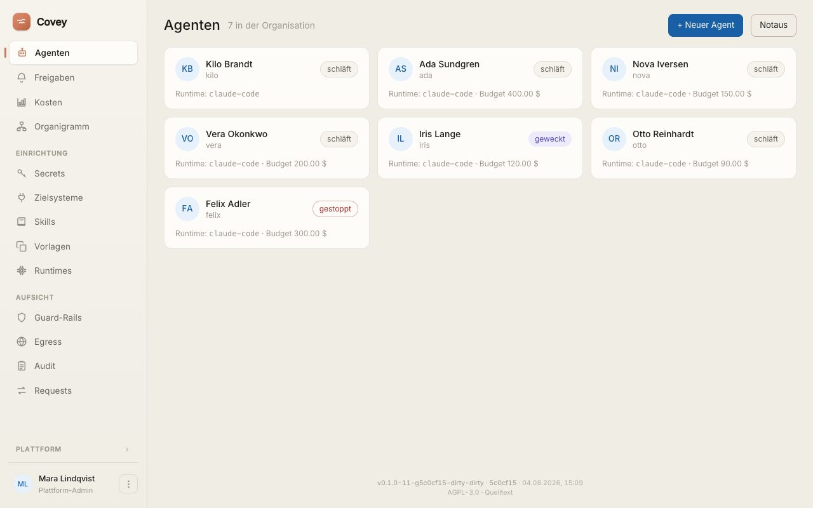
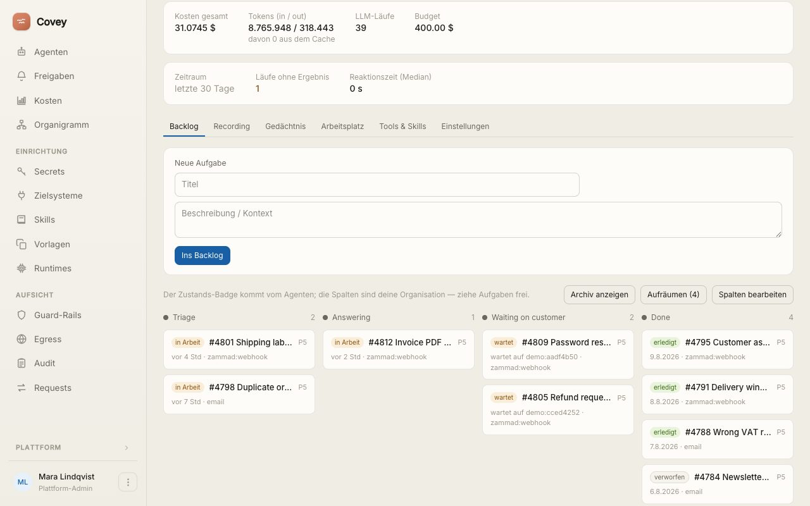
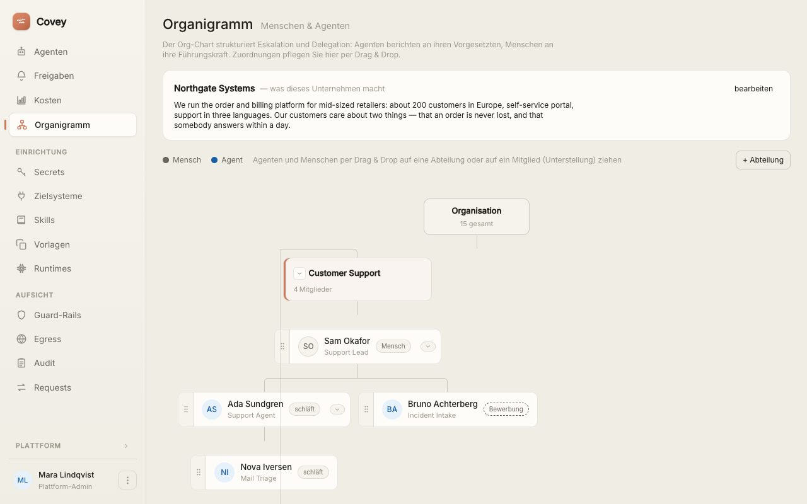
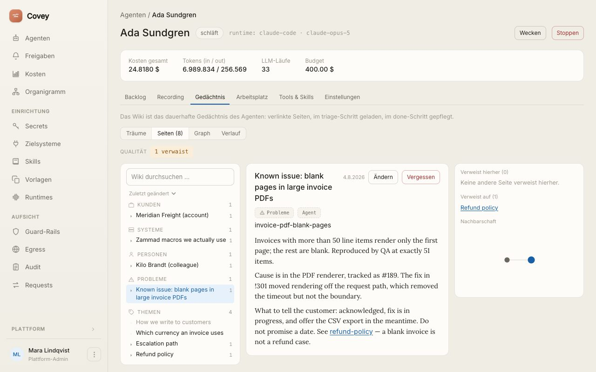
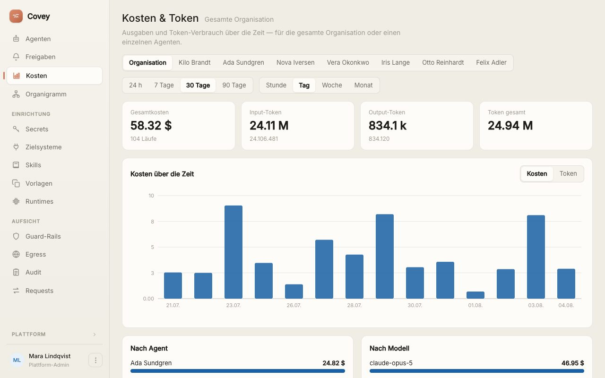
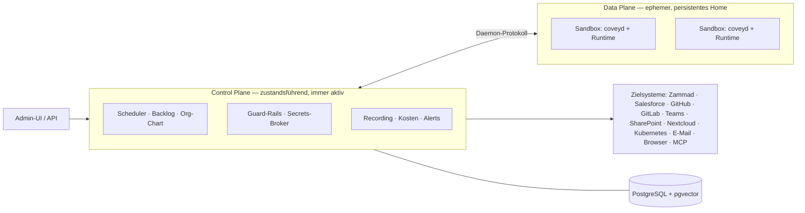

<div align="center">


# Covey

**Die IT- und HR-Abteilung für KI-Agenten.**

Eine Plattform, die KI-Agenten wie Mitarbeiter führt — mit Identität, Arbeitsplatz,<br/>
Zugängen, Backlog und Vorgesetztem. Und mit den Werkzeugen, sie zu überwachen.

[](https://covey.work)
[](go.mod)
[](migrations/)
[](#stack)
[](spec/12-claude-code-adapter.md)

**[covey.work](https://covey.work)** — die Plattform live

**Deutsch** · [English](README.md)

</div>

---

<a id="in-zwei-minuten-starten" name="in-zwei-minuten-starten"></a>

## Starten

**Ohne Go, ohne Node, ohne lokale Postgres** — nur Docker nötig:

```bash
git clone https://github.com/benjaminLedel/covey.git && cd covey
cp .env.example .env
echo "COVEY_MASTER_KEY=$(openssl rand -hex 32)" >> .env   # 32-Byte-Schlüssel
docker pull ghcr.io/benjaminledel/covey-sandbox:base-latest    # der Arbeitsplatz der Agenten, fertig gebaut
docker tag ghcr.io/benjaminledel/covey-sandbox:base-latest covey-sandbox:latest
docker compose up -d --build                              # Postgres + Covey starten
```

Dann **[http://localhost:8494](http://localhost:8494)** öffnen — Login `admin@covey.local` / `covey-admin`. Die **Einrichtung** stellt drei Fragen, jede überspringbar: die Engine und ihr Zugang (geprüft, bevor er gespeichert wird), drei Sätze darüber, was Ihr Unternehmen macht, und ob Sie eine **Personalabteilung** wollen — einen Agenten, dessen Aufgabe es ist, die anderen zu entwerfen. Danach ist *Neuer Agent → Ausschreibung* der kürzeste Weg zur ersten Kollegin: in ein paar Sätzen beschreiben, was sie tun soll, und die Personalabteilung schreibt die Konfiguration. Eine Checkliste **Erste Schritte** auf der Agenten-Übersicht liest den tatsächlichen Zustand der Organisation, hakt sich selbst ab und verschwindet, wenn alles erledigt ist.

Das mitgelieferte [`docker-compose.yml`](docker-compose.yml) bringt Postgres (pgvector) und das covey-Binary mit eingebetteter Admin-UI; `bootstrap` legt Organisation, Admin, einen Demo-Agenten und dessen Platz an, Migrationen laufen automatisch.

Die dritte Zeile holt den Container, in dem ein Agent arbeitet ([`Dockerfile.sandbox`](Dockerfile.sandbox): Claude Code, chromium, git, ripgrep — das Profil `base`); gebaut und veröffentlicht von [der Pipeline des Projekts](.github/workflows/sandbox-images.yml), für amd64 und arm64. `make sandbox-image` baut ihn stattdessen hier, wenn ein fremdes Image nicht in Frage kommt. Entwickler-Agenten wollen darauf das Profil `dev` (`docker pull …:dev-latest`, oder `make sandbox-image-dev`: zusätzlich PHP, JDK und die Versionsmanager `fvm`/`uv`); es wird je Agent gesetzt — man kann sie zum Umsehen auch weglassen: die Plattform startet ohne sie und sagt beim Start und auf der Agenten-Übersicht, dass der erste Lauf scheitern wird, solange sie fehlt.

*Lieber das blanke Binary?* [`install.sh`](#installation) holt es aus dem [neuesten Release](https://github.com/benjaminLedel/covey/releases/latest) und prüft die Checksumme. *Lieber erst schauen?* Die laufende Instanz steht unter **[covey.work](https://covey.work)**. Vollständige Anleitung inkl. erstem Agenten und Produktions-Checkliste: [`docs/quickstart-docker.md`](docs/quickstart-docker.md).

---

> **Codename: Covey.** Ein „covey" ist ein kleiner, koordinierter Schwarm — eine abgestimmte Gruppe, die zusammen unterwegs ist. Genau das ist die Plattform: viele Agenten, zentral orchestriert.

**Coveys Einheit ist die Organisation, nicht der einzelne Nutzer.** Das ist die tragende Abgrenzung zu den Single-User-„AI-Employee"-Apps: Covey ist die Plattform, die ein *Unternehmen* betreibt, um seine gesamte Agenten-Belegschaft zu verwalten und zu governen — mit vielen menschlichen Stakeholdern (IT, Team-Leads, Security/Compliance, Audit, Controlling), zentraler Governance und unternehmensweitem Org-Chart.

## Die Oberfläche



*Siebzehn Sekunden durch die Plattform: die Belegschaft, der Backlog eines Agenten, die Aufzeichnung eines fertigen Laufs, sein Wiki-Gedächtnis, das Organigramm und was das Ganze kostet.*



*Die Belegschaft einer Organisation auf einen Blick — Zustand, Runtime und Budget pro Agent und der Notaus für alle. Darüber die **Bewerbungen**: entworfene Agenten, die auf ihre Einstellung warten.*

| | |
|---|---|
|  |  |
| **Backlog** — Aufgaben als First-Class-Objekte, Spalten frei konfigurierbar; Kosten, Token und Budget stehen im Kopf des Agenten. | **Organigramm** — Menschen und Agenten in derselben Struktur; Abteilung und Unterstellung per Drag & Drop. |
|  |  |
| **Gedächtnis** — was der Agent gelernt hat, lesbar und editierbar: Wissen von Hand ergänzen oder gezielt vergessen lassen. | **Kosten & Token** — Ausgaben über die Zeit, aufgeschlüsselt nach Agent und Modell, für die Organisation oder einen einzelnen Agenten. |

## Was drin ist

| | |
|---|---|
| 🧑‍💼 **Agenten mit Identität** | Eigene Sandbox, eigenes Home, eigene Zugänge — und ein Platz im Org-Chart neben den Menschen. |
| 🧑‍🎓 **Einstellen statt Formular** | Beschreiben, was eine neue Kollegin tun soll; die eigene Personalabteilung — ein Agent — macht daraus eine vollständige Konfiguration und fragt nach, wenn die Ausschreibung zu dünn ist. Heraus kommt ein **Entwurf**: angelegt, ansehbar, änderbar — und er arbeitet erst, wenn ein Mensch ihn einstellt. |
| 📥 **Backlog & Wake-Quellen** | Aufgaben als First-Class-Objekte; Agenten wachen per Webhook, Heartbeat oder Zuruf auf und schlafen danach wieder. |
| 🔌 **Zielsysteme als Plugins** | Zammad, Salesforce, GitHub, GitLab, Microsoft Teams, SharePoint, Nextcloud, Kubernetes, E-Mail (IMAP/SMTP), headless Browser, MCP — keines davon in diesem Repo. Plugins sind eigene Module gegen ein [öffentliches SDK](https://github.com/benjaminLedel/covey-plugin-sdk); die mitgelieferten liegen im [Plugin-Pack](https://github.com/benjaminLedel/covey-plugin-pack), der Rest wird zur Laufzeit aus dem [Katalog](https://github.com/benjaminLedel/covey-plugins) installiert. Ein fremdes Plugin wird genauso gebaut — Zammad, Kubernetes und die Schwachstellen-Datenbanken sind kompiliertes WebAssembly aus demselben Katalog und stehen um nichts besser da als Ihres. |
| 🛡️ **Guard-Rails & Freigaben** | Zentral erzwungen, außerhalb der Runtime, fail-closed. Kritische Aktionen gehen an einen Menschen. |
| 🔑 **Secrets-Broker** | Keine langlebigen Secrets in der Sandbox — Zugriff wird zur Laufzeit gebrokert, kurzlebig und gescopt. |
| 🧩 **Skills** | Prozeduren, die ein Agent nur lädt, wenn sie greifen: Die Beschreibung steht im Kontext, Anleitung und Zusatzdateien werden bei Bedarf gelesen. Org-weite Bibliothek, je Agent verlinkt — ein Lead-Lauf, der nichts zu tun findet, zahlt nicht mehr fünf Playbooks. |
| 🧠 **Wiki-Gedächtnis** | Verlinkte Markdown-Seiten mit pgvector-Index statt flacher Schnipsel — lesbar und von Hand korrigierbar. |
| 📂 **Arbeitsplatz** | Das Home des Agenten im Browser: nachsehen, was da liegt, eine Vorlage, einen Datensatz oder einen ganzen Ordner ablegen, eine Datei ändern, eine Auswahl als ZIP herausziehen. Markdown, Bilder, PDF und Tabellen werden gleich angezeigt. Geht auch, während der Agent schläft, und jede Änderung steht im Recording. |
| 🎥 **Recording & Kill-Switch** | Jeder Lauf aufgezeichnet inkl. Screenshots; Kosten pro Agent und Modell; Notaus für die ganze Organisation. |
| 📦 **Ein Binary** | Frontend und Migrationen sind einkompiliert. Kopieren, `covey serve` — kein nginx, kein separates Frontend-Hosting. |

**CI:** Jeder Push und jeder Pull Request prüft Formatierung, `go vet`, die Go- und Frontend-Tests, `govulncheck` und CodeQL — auf GitHub über [Actions](.github/workflows/), auf GitLab über die Pipeline unten.

**Automatisches Deployment (main → Host):** Jeder Push auf `main` rollt Covey über die GitLab-Pipeline (`test → build → deploy`) auf einen Zielhost aus — so entsteht [covey.work](https://covey.work): das gebaute Image auf den Commit-Tag gepinnt, via [`docker-compose.deploy.yml`](docker-compose.deploy.yml) auf einem Shell-Runner am Host gestartet. Siehe [`docs/ops-deployment.md`](docs/ops-deployment.md).

## Die Leitmetapher

Die Plattform ist die **IT- und HR-Abteilung für KI-Agenten**. Fast jede Komponente hat ein Gegenstück im echten Unternehmen — daraus folgt der Bauplan:

| Im Unternehmen | Auf der Plattform |
|---|---|
| Identität / Active Directory | Agent-Identität (E-Mail optional) |
| Arbeitsplatz / PC | Isolierte, persistente Sandbox |
| Onboarding / Org-Chart | `SOUL.md` + Org-Struktur |
| Belegschaft & Abteilungen | Org-eigene Agenten, Teams, Cost-Center |
| Personalabteilung / IT-Verwaltung | Menschliche Rollen + RBAC + SSO |
| Passwort-Tresor / PAM | Secrets-Broker (kurzlebige Tokens) |
| Aufgabenliste / Ticket | Backlog (First-Class-Objekt) |
| Betriebshandbuch / Compliance | Zentrale Guard-Rails (plattform-erzwungen) |
| SIEM / EDR | Session-Recording + Alerts + Kill-Switch |

## Architektur



Das System zerfällt in eine **Control Plane** (zustandsführend, immer aktiv: Scheduler, Agent-Registry, Backlog-Store, Identitäts- & Secrets-Broker, Guard-Rail-Engine, Observability) und eine **Data Plane** aus isolierten, ephemeren **Sandboxen** mit persistentem Home. In jeder Sandbox läuft ein schlanker **Daemon**, der ein einheitliches Protokoll spricht und die konkrete **Runtime** (Claude Code, …) über einen dünnen **Adapter** bootstrappt. Die Plattform managt die Sandbox, nicht das Framework — dadurch bleibt die Runtime austauschbar. Details in [`spec/01-architecture.md`](spec/01-architecture.md).

## Designprinzipien

1. **Organisation als Einheit, nicht der Nutzer.**
2. **Die Control Plane ist das Produkt.** Sandboxen sind Commodity, Runtimes austauschbar.
3. **Runtime-agnostisch.** Einheitlicher Daemon + dünne Adapter statt Framework-Lock-in.
4. **Immer erreichbar, Compute nur bei Bedarf.** Idle muss wirklich idle sein.
5. **Config-as-Code.** Agentenverhalten versioniert in Git, Änderung via PR/Review.
6. **Niemals langlebige Secrets in die Sandbox.** Zugriff wird zur Laufzeit gebrokert, kurzlebig, gescopt.
7. **Guard-Rails zentral und plattform-erzwungen.** Fail-closed, außerhalb der Runtime durchgesetzt.
8. **Trust by design.** Recording, Freigaben und Kill-Switch sind Grundvoraussetzung, kein Add-on.
9. **Seriell vor parallel.** Ein Agent, eine Aufgabe zur Zeit; Parallelität = mehr Agenten.
10. **Batteries included, but swappable.** Jede Fähigkeit hat einen simplen, DB-gestützten Built-in-Default und ein schmales Interface für einen externen Provider.

## Stack

- **Backend:** ein einziges Go-Binary — API/BFF + Orchestration-Core in einem Prozess, sauber getrennt.
- **Frontend:** React + Tailwind + shadcn/ui + TanStack Query, WebSocket/SSE für Live-Updates — via `//go:embed` ins Binary gebacken.
- **Datenhaltung:** PostgreSQL als Anker — State, Backlog, RBAC, Job-Queue (`SKIP LOCKED`), Pub/Sub (`LISTEN/NOTIFY`), Memory (`pgvector`), verschlüsselte Secret-Spalten (AES-GCM).
- **Default:** `builtin` überall — faktisch **Binary + Postgres + Docker, sonst nichts**. Keycloak/Vault/Redis sind optional zuschaltbar, nicht Voraussetzung.

Details in [`spec/10-architecture-stack.md`](spec/10-architecture-stack.md).

## Installation

```bash
curl -sSL https://raw.githubusercontent.com/benjaminLedel/covey/main/installer/install.sh | sh
```

Holt das Binary für System und Architektur aus dem neuesten [Release](https://github.com/benjaminLedel/covey/releases), **prüft die SHA-256-Summe** und legt es nach `/usr/local/bin`.

Covey besteht aus zwei Programmen — der Control Plane (`covey`) und dem Runner (`covey-runner`, der Sandboxen für einen Server fährt). Am Terminal fragt das Skript, welches du willst; in einer Pipeline ohne Terminal nimmt es die Voreinstellung, statt auf eine Antwort zu warten, die niemand geben kann. Oder gleich sagen: `--server`, `--runner`, `--all`. Version festnageln mit `--version v0.2.0`, anderes Ziel mit `--bin-dir ~/bin`.

**Jede laufende Covey-Instanz liefert dasselbe Skript für ihre eigene Version aus:**

```bash
curl -sSL https://covey.example/install.sh | sh
```

Praktisch beim Aufsetzen eines Runners: Die Instanz kennt ihre Version, der Runner spricht damit dasselbe Protokoll wie der Server, bei dem er sich anmeldet. Die Binaries kommen weiterhin aus dem GitHub-Release — die Instanz bestimmt die Version, nicht den Inhalt.

Wer ein Skript nicht ungelesen in eine Shell pipen mag — eine gesunde Haltung — nimmt den zweistufigen Weg:

```bash
curl -sSLO https://raw.githubusercontent.com/benjaminLedel/covey/main/installer/install.sh
less install.sh && sh install.sh
```

Das installiert nur Binaries. Die Control Plane braucht zusätzlich PostgreSQL (mit pgvector) und Docker für die Sandboxen; die restlichen Schritte nennt das Skript am Ende, der ausführliche Weg samt docker-compose steht in [`docs/ops-deployment.md`](docs/ops-deployment.md).

## Entwicklung

```bash
make dev-db       # Postgres (pgvector) via Docker auf Port 5433
make bootstrap    # Frontend + Binaries bauen, migrieren, Org/Admin/Agent anlegen
make run          # covey serve auf http://localhost:8494
```

**Sandbox-Isolation.** Die Control Plane startet Sandboxen als Container (**docker-Provider**, Default) — echte Isolation auf Container-Ebene. Vor dem ersten Start die Images bauen: `make sandbox-image` für das Profil `base` ([`Dockerfile.sandbox`](Dockerfile.sandbox): coveyd + Claude Code + chromium für das `browser`-Plugin) und `make sandbox-image-dev` für `dev` ([`Dockerfile.sandbox.dev`](Dockerfile.sandbox.dev): zusätzlich PHP, JDK und die Versionsmanager `fvm`/`uv`). **Das Image hängt am Agenten**, nicht an der Instanz: ein Support- oder Mail-Agent läuft auf `base` und trägt nicht länger die JVM des Entwickler-Agenten mit; das Profil wird je Agent in der Oberfläche gesetzt, und ein eigenes Image ist dort ein gültiger Wert. `COVEY_SANDBOX_IMAGE` / `COVEY_SANDBOX_IMAGE_DEV` überschreiben, worauf die beiden Profile zeigen; das erste bleibt zugleich die Voreinstellung für Agenten ohne eigene Angabe. Die Regel beim Erweitern: **Version → Home, Toolchain → Image** — SDK-Versionen zieht sich der Agent nach dem Pin im Projekt-Repo selbst ins persistente Home ([`docs/ops-deployment.md`](docs/ops-deployment.md)).

**Anmeldung.** `admin@covey.local` / `covey-admin`, überschreibbar via `COVEY_ADMIN_EMAIL` / `COVEY_ADMIN_PASSWORD` beim Bootstrap.

**Runtime-Zugang.** Damit die Claude-Code-Runtime arbeiten kann, muss eines dieser Secrets hinterlegt sein:

| Secret | Wofür |
|---|---|
| `anthropic_api_key` | API-Key (Pay-as-you-go) |
| `claude_code_oauth_token` | Abo-Account — Token einmalig mit `claude setup-token` erzeugen |

Ohne eines von beiden scheitern Aufgaben mit „Not logged in · Please run /login": die Sandbox hat ein eigenes, leeres `HOME`, die lokale `claude`-Anmeldung ist dort nicht sichtbar.

**Welcher Stand läuft?** `covey version` zeigt Version, Commit und Bauzeit — dieselbe Angabe steht in der Startzeile von `covey serve`, unter `GET /api/v1/version` (angemeldet) und im Fuß der Sidebar in der UI. In einer Sandbox beantwortet `coveyd version` dasselbe für das Sandbox-Image. Die Werte kommen beim Bauen ins Binary: `make build` zieht sie aus Git, die Container-Builds aus den Build-Args `VERSION` / `COMMIT` / `DATE` (die CI füllt sie aus `$CI_COMMIT_*`).

**Tests.** `make test` (Unit) und `make test-integration` (voller Durchstich gegen die Dev-DB, mit Mock-Runtime und Fake-Zammad; skippt, wenn Port 5433 nicht erreichbar ist). Für Demos ohne echtes Zammad: `go run ./demo/fakezammad`, dann die Secrets `zammad_url` = `http://localhost:9999` und `zammad_token` (beliebig) setzen.

## Configs prüfen nach einem Update

```bash
covey config lint          # ändert nichts, meldet nur
covey config lint --json   # maschinenlesbar
```

Der Plattform-Anteil des System-Prompts (Abschluss-Protokoll, `covey/`-Meta-Aktionen, Stage-Regeln) wird zur Dispatch-Zeit kompiliert und kommt mit dem Binary — dafür ist nach einem Update **nichts** zu tun. Die **Agenten-Config** dagegen ist von Menschen geschrieben und bleibt, wie sie ist. `covey config lint` sagt, welche Agenten davon nachgezogen werden sollten, und warum:

- **Heartbeat-Intervall zu kurz** für die Zielsysteme des Agenten (ein Repo alle 2 Minuten zu klonen ist etwas anderes, als ein Postfach zu sichten).
- **Keine sichtbare Spur:** GitLab-gegateter Heartbeat, aber kein Playbook-Schritt kommentiert — der Vorgang gilt beim nächsten Intervall wieder als unbearbeitet und weckt endlos erneut.
- **`blocked` bei einem Polling-Zielsystem**, das keinen Webhook hat, der die Aufgabe je wieder weckt.
- **Board-Spalten**, die einen Vorgang statt eines Arbeitszustands benennen (`#83 CSV-Import`), oder schlicht zu viele davon.
- **Häufige Turn-Limit-Abbrüche** — Auftrag zu groß geschnitten oder `max_turns` zu klein.

Exit-Code 1 bei Befunden, damit ein Upgrade-Skript darauf reagieren kann. Geändert wird im Config-Tab der Oberfläche oder per `POST /api/v1/agents/{id}/config/import` — beides versioniert.

## Betriebs-Doku

Spezifikation und Runbooks sind auf **Englisch** — sie richten sich an alle, die Covey installieren und betreiben, nicht nur an den deutschsprachigen Teil davon. Die Oberfläche gibt es in beiden Sprachen.

| Dokument | Inhalt |
|---|---|
| [`docs/quickstart-docker.md`](docs/quickstart-docker.md) | Compose-Setup, erster Agent, Produktions-Checkliste |
| [`docs/upgrade.md`](docs/upgrade.md) | Upgrades, die mehr als einen Neustart brauchen — was vorher zu bauen und zu sichern ist |
| [`docs/ops-runner.md`](docs/ops-runner.md) | Runner: Sandboxen auf mehr als einem Host, der Home-Store, harte Egress-Isolation |
| [`docs/ops-deployment.md`](docs/ops-deployment.md) | CI-Pipeline, Auto-Deploy auf einen Zielhost |
| [`docs/ops-zammad.md`](docs/ops-zammad.md) | Zammad anbinden: API-Token, Webhook + Trigger, kundensichtbare Antworten |
| [`docs/ops-github.md`](docs/ops-github.md) | GitHub: Issues, Pull Requests, Actions, Checkout in der Sandbox |
| [`docs/ops-gitlab.md`](docs/ops-gitlab.md) | GitLab: Issues, Merge Requests, Checkout in der Sandbox |
| [`docs/ops-email.md`](docs/ops-email.md) | E-Mail-Postfach als Wake-Quelle (IMAP/SMTP) |
| [`docs/ops-teams.md`](docs/ops-teams.md) | Microsoft Teams als Kanal zwischen Mensch und Agent |
| [`docs/ops-sharepoint.md`](docs/ops-sharepoint.md) | SharePoint/Teams-Dateien via Microsoft Graph |
| [`docs/ops-nextcloud.md`](docs/ops-nextcloud.md) | Nextcloud-Dateien via WebDAV |
| [`docs/ops-browser.md`](docs/ops-browser.md) | Headless Chrome: Web-UIs bedienen, Screenshots ins Recording |
| [`docs/ops-vulndb.md`](docs/ops-vulndb.md) | Bekannte Schwachstellen in Paket-Abhängigkeiten (npm, Composer, Dart/Flutter) |
| [`docs/ops-k8s.md`](docs/ops-k8s.md) | Einen Kubernetes-Cluster lesen: ServiceAccount, Token, Cluster-CA |

## Repository-Inhalt

| Pfad | Inhalt |
|---|---|
| [`spec/`](spec/) | Die vollständige Spezifikation (Einstieg: [`spec/README.md`](spec/README.md)) |
| [`docs/`](docs/) | Betriebs- und Anbindungs-Runbooks |
| `cmd/covey/` | Control-Plane-Binary: `serve`, `migrate`, `bootstrap`, `passwd`, `genkey` |
| `cmd/coveyd/` | Sandbox-Daemon (spricht das Daemon-Protokoll, bootstrappt die Runtime) |
| `internal/` | Orchestrator, Agents, Backlog, Identity/Secrets, Guard-Rails, Observability, Memory, Egress, Org, Vorlagen, die Plugin-Maschinerie (`target/`: Manifest-Engine, wasm-Laufzeit, MCP, Aktivierung pro Org), HTTP-API |
| `migrations/` | Versionierte SQL-Migrationen (via `//go:embed` ins Binary gebacken) |
| `web/` | React/Vite/Tailwind-Admin-UI (`dist/` wird eingebettet) |
| `skills/covey-agent/` | Claude-Code-Skill zum Bauen und Aktualisieren von Covey-Agenten |
| [`examples/`](examples/) | Fertige Agenten-Bundles: Coding-Agent, QA-Agent, Web-Rechercheur, Log-Triage |
| `demo/fakezammad/` | Minimales Zammad-Double für lokale Demos |
| `demo/seed/`, `demo/tour/` | Die Demo-Organisation hinter den Bildern oben, und das Programm, das sie neu aufnimmt |
| `mockup/` | Statischer HTML-Mockup der Admin-Oberfläche |

<details>
<summary><b>Die Spec-Dokumente im Einzelnen</b></summary>

<br/>

| Datei | Inhalt |
|---|---|
| [`spec/01-architecture.md`](spec/01-architecture.md) | System-Übersicht, Control/Data Plane, Runtime-Abstraktion, Daemon-Protokoll |
| [`spec/02-agent-model.md`](spec/02-agent-model.md) | Der Agent als Entität: Identität, Sandbox, Zugänge, Config-as-Code, Org-Chart |
| [`spec/03-lifecycle-scheduling.md`](spec/03-lifecycle-scheduling.md) | Zustandsmaschine, Dispatch-Loop, Wake-Quellen, Backlog, Blocking, Korrelation |
| [`spec/04-identity-secrets.md`](spec/04-identity-secrets.md) | Keycloak, RFC 8693 Token Exchange, Secrets-Broker, Threat-Model |
| [`spec/05-memory.md`](spec/05-memory.md) | Memory-Schichten, LLM-Wiki (Markdown + pgvector), persistentes Home |
| [`spec/06-observability-control.md`](spec/06-observability-control.md) | Guard-Rails, Session-Recording, Approval-Gates, Kill-Switch, Kosten, Supervisor |
| [`spec/07-open-decisions.md`](spec/07-open-decisions.md) | Offene Fragen, Build-vs-Buy, MVP-Scope |
| [`spec/08-market.md`](spec/08-market.md) | Marktrecherche: Konkurrenz, Open-Source-Bausteine, Build-vs-Adopt |
| [`spec/09-enterprise-model.md`](spec/09-enterprise-model.md) | Organisation als Einheit: Rollen & RBAC, SSO, Mandanten, Cost-Center, Compliance |
| [`spec/10-architecture-stack.md`](spec/10-architecture-stack.md) | Frontend, Backend-Sprache, „batteries included, but swappable", Postgres-Anker |
| [`spec/11-mvp-plan.md`](spec/11-mvp-plan.md) | Bau-Reihenfolge M0–M7, kritischer Pfad, Abnahme-Checkliste |
| [`spec/12-claude-code-adapter.md`](spec/12-claude-code-adapter.md) | Erster Runtime-Adapter: Claude Code headless via `claude -p` |
| [`spec/13-zammad-integration.md`](spec/13-zammad-integration.md) | Zielsystem Zammad: Wake via Webhook, REST-Aktionen, `blocked`↔`pending` |
| [`spec/14-companion-memory.md`](spec/14-companion-memory.md) | Companion: Brain-Dump & Kontext aus dem Wissen der Menschen |
| [`spec/15-teams-integration.md`](spec/15-teams-integration.md) | Microsoft Teams als Zielsystem: OAuth2/JWT, Chat als Kanal |
| [`spec/16-runner.md`](spec/16-runner.md) | Verteilte Data Plane: registrierte Runner, der zentrale Home-Store, Sandbox-Images pro Agent |

</details>

## Status

**Deutlich über den MVP hinaus.** Der Durchstich aus [`spec/11-mvp-plan.md`](spec/11-mvp-plan.md) (M0–M7) steht; darauf aufgesetzt sind Org-Chart & Abteilungen, Mitarbeiter-Profile, weitere Zielsystem-Plugins (Salesforce, GitHub, GitLab, Teams, SharePoint, Nextcloud, E-Mail, Browser, MCP), Docker-Sandboxen, Egress-Kontrolle, Agenten-Vorlagen und das Wiki-Gedächtnis. Die Abnahme-Checkliste läuft als Integrationstest-Suite (`internal/integration/`).

## Mitwirken

Änderungen an Konzept und Architektur gehen über die Spec: Vorschläge als Merge Request gegen [`spec/`](spec/), Diskussion offener Punkte in [`spec/07-open-decisions.md`](spec/07-open-decisions.md). Für Code gilt die Bau-Reihenfolge aus dem MVP-Plan — dünnster vertikaler Durchstich zuerst, `builtin` als Default, Interface vor Implementierung.

## Lizenz

Copyright (C) 2026 Benjamin Ledel

Covey ist freie Software unter der [GNU Affero General Public License v3.0](LICENSE). Du darfst sie betreiben, studieren, verändern und weitergeben. Die eine Pflicht, die in der Praxis zählt: Wer ein *verändertes* Covey anderen über ein Netzwerk anbietet, muss diesen Nutzern seinen geänderten Quellcode unter denselben Bedingungen zugänglich machen.

Covey im eigenen Unternehmen selbst zu hosten, löst nichts davon aus — es zu betreiben, wie auch immer konfiguriert, ist schlicht Benutzung.
