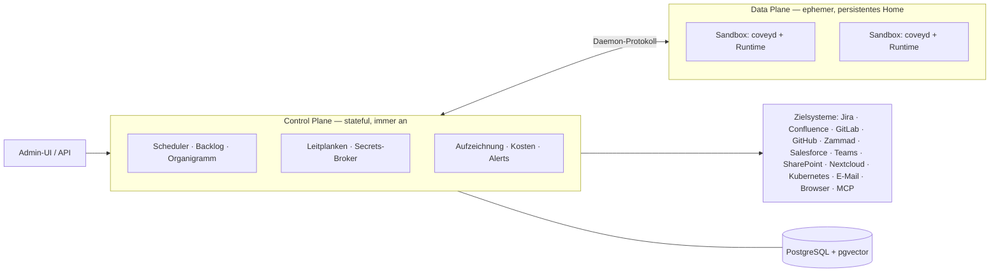

<div align="center">


# Covey

**Die IT- und HR-Abteilung für KI-Agenten.**

Jeder Agent bekommt seine eigene Sandbox, seine eigenen Zugänge und seinen eigenen Backlog.<br/>
Sie verteilen die Arbeit, setzen die Grenzen und lesen nach, was getan wurde.

[](https://covey.work)
[](https://github.com/benjaminLedel/covey/actions/workflows/ci.yml)
[](https://github.com/benjaminLedel/covey/releases/latest)
[](go.mod)
[](LICENSE)

**[covey.work](https://covey.work)** — eine laufende Instanz, bevor Sie irgendetwas installieren

**Deutsch** · [English](README.md)

</div>

---


<div align="center">

*Siebzehn Sekunden durch die Plattform: die Belegschaft, der Backlog eines Agenten, die Aufzeichnung eines fertigen Laufs, sein Wiki-Gedächtnis, das Organigramm und was das Ganze kostet.*

</div>

---

## Was Covey ist

Covey ist eine selbst gehostete Plattform, um KI-Agenten im Unternehmen zu betreiben. Sie legen einen Agenten an, geben ihm Zugang zu den Systemen, die er braucht, und er arbeitet seinen Backlog selbständig ab. Alles, was er tut, wird protokolliert, und alles, was er kostet, wird gezählt.

Drei Beispiele für das, was ein Agent hier tut:

- **Support** — beobachtet eine Zammad-Queue, beantwortet, was er kann, und eskaliert den Rest.
- **Entwicklung** — nimmt ein Jira-Ticket, checkt das Repository aus, öffnet einen Merge Request und verlinkt ihn zurück am Ticket.
- **QA** — klickt sich in einem headless Browser durch eine Weboberfläche und meldet, was kaputt ist.

Ein Agent schläft, bis ein Webhook, eine geplante Prüfung oder ein Mensch ihn weckt; ein untätiger Agent kostet deshalb nichts. Worauf er zugreifen darf, entscheidet die Plattform und nicht der Prompt des Agenten. Seine Aktionen und Screenshots landen in einer Aufzeichnung, die Sie später lesen können, die Ausgaben sind nach Agent und Modell aufgeschlüsselt, und ein Knopf stoppt alle Agenten der Organisation auf einmal.

Covey ist für Organisationen gebaut, nicht für eine einzelne Person am Schreibtisch. Mehrere Leute verwalten es — IT, Team-Leads, Security, Controlling —, Rechte und Leitplanken werden zentral gesetzt, und Menschen und Agenten stehen im selben Organigramm.

**Status:** Covey ist einsatzbereit. [covey.work](https://covey.work) läuft auf dem `main` dieses Repos und wird bei jedem Push neu ausgerollt; Releases sind versioniert, Upgrades dokumentiert, und eine Integrationssuite deckt den ganzen Weg vom Wecken bis zum Ergebnis ab.

> **Codename.** Ein „covey" ist ein kleiner Schwarm, der zusammen unterwegs ist — ungefähr das, was die Plattform mit Agenten macht.

<a id="in-zwei-minuten-starten" name="in-zwei-minuten-starten"></a>

## In zwei Minuten zur laufenden Instanz

**Ohne Go, ohne Node, ohne lokale Postgres.** Nur Docker nötig:

```bash
git clone https://github.com/benjaminLedel/covey.git && cd covey
cp .env.example .env
echo "COVEY_MASTER_KEY=$(openssl rand -hex 32)" >> .env
make sandbox-images-pull        # die fertigen Arbeitsplätze, in denen ein Agent läuft
docker compose up -d --build    # Postgres + Covey
```

**[http://localhost:8494](http://localhost:8494)** öffnen, Login `admin@covey.local` / `covey-admin`.

Die Einrichtung fragt drei Dinge ab, und Sie können jedes davon überspringen: welche Engine mit welchem Zugang (er wird geprüft, bevor er gespeichert wird), ein paar Sätze darüber, was Ihr Unternehmen macht, und ob Sie eine **Personalabteilung** wollen — einen Agenten, der die Konfiguration für andere Agenten schreibt.

Für den ersten Agenten gehen Sie auf *Neuer Agent → Ausschreibung* und beschreiben die Aufgabe in ein paar Sätzen. Die Personalabteilung macht daraus eine Konfiguration, die Sie durchlesen und ändern können, bevor Sie ihn einstellen.

Was diese fünf Befehle einrichten:

- [`docker-compose.yml`](docker-compose.yml) bringt Postgres (pgvector) und das covey-Binary mit eingebetteter Admin-UI. Migrationen laufen beim Start; `bootstrap` legt Organisation, Admin und einen Demo-Agenten an.
- `make sandbox-images-pull` holt die Container, in denen ein Agent arbeitet — `base` ([`Dockerfile.sandbox`](Dockerfile.sandbox): Claude Code, chromium, git, ripgrep), `dev` (zusätzlich PHP, JDK und die Versionsmanager `fvm`/`uv`) und die Rollen-Arbeitsplätze `dev-flutter`, `dev-php` und `dev-web` für Agenten, deren Feld feststeht ([`docs/ops-workplaces.md`](docs/ops-workplaces.md)), für amd64 und arm64, gebaut von [der Pipeline des Projekts](.github/workflows/sandbox-images.yml). `SANDBOX_PROFILES="base dev-web"` holt nur, was gebraucht wird; `make sandbox-images` baut sie stattdessen hier.

Vollständige Anleitung inklusive erstem Agenten und Produktions-Checkliste: [`docs/quickstart-docker.md`](docs/quickstart-docker.md).

## Was Sie bekommen

| | |
|---|---|
| 🧑‍💼 **Eine Identität je Agent** | Eine eigene Sandbox, ein eigenes Home und eigene Zugänge, dazu ein Platz im Organigramm neben den Menschen. |
| 🧑‍🎓 **Einstellen statt Formular** | Die Aufgabe in ein paar Sätzen beschreiben; die Personalabteilung schreibt die Konfiguration und fragt nach, wenn die Ausschreibung zu dünn ist. Heraus kommt ein Entwurf — er arbeitet erst, wenn ein Mensch ihn einstellt. |
| 📥 **Backlog und Wake-Quellen** | Aufgaben als First-Class-Objekte. Agenten wachen per Webhook, Heartbeat oder Zuruf auf und schlafen danach wieder. |
| 🔌 **Zielsysteme als Plugins** | Jira, Confluence, GitLab, GitHub, Zammad, Salesforce, Teams, SharePoint, Nextcloud, Kubernetes, E-Mail (IMAP/SMTP), headless Browser, MCP. |
| 🛡️ **Leitplanken und Freigaben** | Zentral erzwungen, außerhalb der Runtime, fail-closed. Kritische Aktionen warten auf einen Menschen. |
| 🔑 **Secrets-Broker** | Kein langlebiges Secret gelangt je in eine Sandbox. Zugriff wird pro Lauf gebrokert, kurzlebig und gescopt. |
| 🧩 **Skills** | Prozeduren, die ein Agent nur lädt, wenn sie greifen — die Beschreibung steht im Kontext, die Anleitung wird bei Bedarf gelesen. |
| 🧠 **Wiki-Gedächtnis** | Verlinkte Markdown-Seiten mit pgvector-Index statt flacher Schnipsel. Lesbar und von Hand korrigierbar. |
| 📂 **Arbeitsplatz** | Das Home des Agenten im Browser: durchsehen, Dateien ablegen, eine ändern, eine Auswahl als ZIP herausziehen. Geht auch, während der Agent schläft. |
| 🎥 **Aufzeichnung und Not-Aus** | Jeder Lauf aufgezeichnet inklusive Screenshots, Kosten pro Agent und Modell, ein Notaus für die ganze Organisation. |
| 📦 **Ein Binary** | Frontend und Migrationen sind einkompiliert. Kopieren, `covey serve` — kein nginx, kein separates Frontend-Hosting. |

Keines dieser Zielsysteme liegt in diesem Repository. Jedes ist ein eigenes Go-Modul gegen ein [öffentliches SDK](https://github.com/benjaminLedel/covey-plugin-sdk). Die mitgelieferten stehen im [Plugin-Pack](https://github.com/benjaminLedel/covey-plugin-pack), die übrigen werden zur Laufzeit aus dem [Katalog](https://github.com/benjaminLedel/covey-plugins) installiert, ohne dass etwas neu gebaut wird. Zammad, Kubernetes und die Schwachstellen-Datenbanken laufen als WebAssembly-Module aus genau diesem Katalog, auf demselben Weg, auf dem auch ein selbst geschriebenes Plugin installiert wird. Für die von uns geschriebenen gibt es keine bevorzugte Klasse.

## Wie es aussieht


*Die Belegschaft einer Organisation auf einen Blick — Zustand, Runtime und Budget je Agent, und der Kill-Switch für alle. Darüber die **Bewerbungen**: Agenten, die entworfen sind und darauf warten, eingestellt zu werden.*

| | |
|---|---|
|  |  |
| **Backlog** — Aufgaben als First-Class-Objekte mit frei konfigurierbaren Spalten; Kosten, Tokens und Budget stehen im Kopf des Agenten. | **Organigramm** — Menschen und Agenten in derselben Struktur; Abteilung und Berichtslinie per Drag & Drop. |
|  |  |
| **Gedächtnis** — was der Agent gelernt hat, lesbar und änderbar: Wissen von Hand ergänzen oder gezielt vergessen lassen. | **Kosten & Tokens** — Ausgaben über die Zeit, aufgeschlüsselt nach Agent und Modell, für die ganze Organisation oder einen einzelnen Agenten. |

## Wie es funktioniert



Die **Control Plane** ist immer an und hält den Zustand: Scheduler, Agenten-Registry, Backlog, Identitäts- und Secrets-Broker, Leitplanken, Observability. Die **Data Plane** ist eine Menge isolierter Sandboxes mit persistentem Home-Verzeichnis. Eine Sandbox ist Wegwerfware — geht eine verloren, wird sie aus Config und Home neu gebaut.

In jeder Sandbox spricht ein kleiner **Daemon** ein einziges Protokoll zur Control Plane, und ein **Adapter** startet darin die eigentliche Runtime, derzeit Claude Code. Weil Covey die Sandbox verwaltet und nicht das Agenten-Framework, rührt ein Austausch der Runtime den Rest des Systems nicht an. Details in [`spec/01-architecture.md`](spec/01-architecture.md).

Die meisten Teile des Systems haben ein Gegenstück im gewöhnlichen Unternehmen:

| Im Unternehmen | Auf der Plattform |
|---|---|
| Identität / Active Directory | Agent-Identität (E-Mail optional) |
| Arbeitsplatz / PC | Isolierte, persistente Sandbox |
| Onboarding / Organigramm | `SOUL.md` + Org-Struktur |
| Belegschaft & Abteilungen | Org-eigene Agenten, Teams, Cost-Center |
| Personalabteilung / IT-Verwaltung | Menschliche Rollen + RBAC + SSO |
| Passwort-Tresor / PAM | Secrets-Broker (kurzlebige Tokens) |
| Aufgabenliste / Ticket | Backlog (First-Class-Objekt) |
| Betriebshandbuch / Compliance | Zentrale Leitplanken (plattform-erzwungen) |
| SIEM / EDR | Session-Recording + Alerts + Kill-Switch |

**Der Stack:**

- Ein Go-Binary. API und Orchestrierung laufen im selben Prozess.
- Ein Frontend aus React + Tailwind + shadcn/ui, per `//go:embed` in dieses Binary kompiliert.
- PostgreSQL für alles Zustandsbehaftete: Backlog, RBAC, Job-Queue (`SKIP LOCKED`), Pub/Sub (`LISTEN/NOTIFY`), Gedächtnis (`pgvector`) und AES-GCM-verschlüsselte Secret-Spalten.
- `builtin`-Implementierungen als Vorgabe. Keycloak, Vault und Redis werden unterstützt, sind aber nie Voraussetzung.

Details in [`spec/10-architecture-stack.md`](spec/10-architecture-stack.md).

## Entwurfsprinzipien

1. **Die Organisation ist die Einheit, nicht der Nutzer.**
2. **Die Control Plane ist das Produkt.** Sandboxes sind Massenware, Runtimes austauschbar.
3. **Runtime-agnostisch.** Ein Daemon-Protokoll plus dünne Adapter statt Framework-Lock-in.
4. **Immer erreichbar, Rechenzeit nur bei Bedarf.** Idle muss Idle heißen.
5. **Config as Code.** Agenten-Verhalten in Git versioniert, per PR und Review geändert — nicht per Deploy.
6. **Nie langlebige Secrets in die Sandbox.** Zugriff wird zur Laufzeit gebrokert, kurzlebig und gescopt.
7. **Leitplanken zentral und plattform-erzwungen.** Fail-closed, außerhalb der Runtime durchgesetzt.
8. **Vertrauen by Design.** Aufzeichnung, Freigaben und Not-Aus sind Voraussetzung, nicht Beiwerk.
9. **Seriell vor parallel.** Ein Agent, eine Aufgabe zur Zeit; Parallelität heißt mehr Agenten.
10. **Batteries included, but swappable.** Jede Fähigkeit hat eine einfache DB-gestützte Vorgabe und eine schmale Schnittstelle für einen externen Anbieter.

<a id="installation" name="installation"></a>

## Das Binary installieren

Covey läuft auch ohne Docker Compose. Der Installer holt das Binary für Ihr Betriebssystem und Ihre Architektur aus dem [neuesten Release](https://github.com/benjaminLedel/covey/releases/latest), **prüft die SHA-256-Summe** und legt es nach `/usr/local/bin`:

```bash
curl -sSL https://raw.githubusercontent.com/benjaminLedel/covey/main/installer/install.sh | sh
```

Zum Lesen, bevor es läuft:

```bash
curl -sSLO https://raw.githubusercontent.com/benjaminLedel/covey/main/installer/install.sh
less install.sh && sh install.sh
```

Es gibt zwei Programme: die Control Plane (`covey`) und den Runner (`covey-runner`), der Sandboxes im Auftrag eines Servers ausführt. Am Terminal fragt das Skript, welches Sie wollen; ohne Terminal nimmt es die Vorgabe. Sie können es auch direkt sagen — `--server`, `--runner` oder `--all` —, eine Version mit `--version v0.8.0` festzurren oder das Zielverzeichnis mit `--bin-dir ~/bin` ändern.

**Jede laufende Instanz liefert dasselbe Skript für ihre eigene Version aus:**

```bash
curl -sSL https://covey.example/install.sh | sh
```

So fügen Sie einen Runner hinzu. Die Instanz kennt ihre eigene Version, also bekommen Sie einen Runner, der dasselbe Protokoll spricht wie der Server, bei dem er sich registrieren wird. Die Binaries kommen weiterhin aus dem GitHub-Release; die Instanz bestimmt die Version, nicht den Inhalt.

Das installiert nur Binaries. Die Control Plane braucht zusätzlich PostgreSQL (mit pgvector) und Docker für die Sandboxes; das Skript nennt, was noch fehlt, und [`docs/ops-deployment.md`](docs/ops-deployment.md) hat den vollständigen Weg.

## Dokumentation

Alle Runbooks sind auf Englisch.

| Dokument | Inhalt |
|---|---|
| [`docs/quickstart-docker.md`](docs/quickstart-docker.md) | Compose-Setup, erster Agent, Produktions-Checkliste |
| [`docs/ops-deployment.md`](docs/ops-deployment.md) | CI-Pipeline, Auto-Deploy auf einen Zielhost |
| [`docs/upgrade.md`](docs/upgrade.md) | Upgrades, die mehr brauchen als einen Neustart — was vorher zu bauen und zu sichern ist |
| [`docs/api-keys.md`](docs/api-keys.md) | API-Keys: Covey von außen steuern — was ein Key darf und was nur der Browser darf |
| [`docs/ops-runner.md`](docs/ops-runner.md) | Runner: Sandboxes auf mehreren Hosts, der Home-Store, harte Egress-Isolation |
| [`docs/ops-workplaces.md`](docs/ops-workplaces.md) | Arbeitsplätze: in welchem Image ein Agent arbeitet, die Rollen-Images, ein eigener Arbeitsplatz |
| [`docs/ops-zammad.md`](docs/ops-zammad.md) | Zammad: API-Token, Webhook + Trigger, kundensichtbare Antworten |
| [`docs/ops-github.md`](docs/ops-github.md) | GitHub: Issues, Pull Requests, Actions, Checkout in der Sandbox |
| [`docs/ops-gitlab.md`](docs/ops-gitlab.md) | GitLab: Issues, Merge Requests, Checkout in der Sandbox |
| [`docs/ops-jira.md`](docs/ops-jira.md) | Jira: das Ticket neben dem Repository — Cloud und Data Center, der Workflow, das Heartbeat-Gate |
| [`docs/ops-confluence.md`](docs/ops-confluence.md) | Confluence: die Dokumentation als Kontext und als Ort für Ergebnisse |
| [`docs/ops-email.md`](docs/ops-email.md) | Ein E-Mail-Postfach als Wake-Quelle (IMAP/SMTP) |
| [`docs/ops-teams.md`](docs/ops-teams.md) | Microsoft Teams als Kanal zwischen Mensch und Agent |
| [`docs/ops-sharepoint.md`](docs/ops-sharepoint.md) | SharePoint- / Teams-Dateien über Microsoft Graph |
| [`docs/ops-nextcloud.md`](docs/ops-nextcloud.md) | Nextcloud-Dateien über WebDAV |
| [`docs/ops-browser.md`](docs/ops-browser.md) | Headless Chrome: Weboberflächen bedienen, Screenshots in die Aufzeichnung |
| [`docs/ops-vulndb.md`](docs/ops-vulndb.md) | Bekannte Schwachstellen in Paket-Abhängigkeiten (npm, Composer, Dart/Flutter) |
| [`docs/ops-k8s.md`](docs/ops-k8s.md) | Einen Kubernetes-Cluster lesen: ServiceAccount, Token, Cluster-CA |

Die vollständige Spezifikation liegt in [`spec/`](spec/) — Einstieg über [`spec/README.md`](spec/README.md).

<details>
<summary><b>Eine Instanz betreiben: was ein Update braucht</b></summary>

<br/>

Die Plattform-Hälfte des System-Prompts (Abschlussprotokoll, `covey/`-Meta-Aktionen, Stage-Regeln) wird beim Dispatch kompiliert und kommt mit dem Binary — dort ist nach einem Update **nichts** zu tun. Die **Agenten-Config** dagegen ist von Menschen geschrieben und bleibt exakt, wie sie ist. `covey config lint` sagt, welche Agenten mitgenommen werden sollten, und warum:

```bash
covey config lint          # ändert nichts, meldet nur
covey config lint --json   # maschinenlesbar
```

- **Heartbeat-Intervall zu kurz** für die Zielsysteme dieses Agenten (ein Repository alle zwei Minuten zu klonen ist etwas anderes, als ein Postfach zu prüfen).
- **Keine sichtbare Spur:** ein GitLab-gegateter Heartbeat, bei dem kein Playbook-Schritt kommentiert — das Element gilt beim nächsten Intervall als unberührt und weckt den Agenten endlos weiter.
- **`blocked` an einem pollenden Zielsystem**, das keinen Webhook hat, der die Aufgabe je wieder aufweckt.
- **Board-Spalten**, die ein Element benennen statt einen Zustand der Arbeit (`#83 CSV-Import`), oder schlicht zu viele davon.
- **Häufige Turn-Limit-Abbrüche** — der Auftrag ist zu groß geschnitten, oder `max_turns` ist zu klein.

Exit-Code 1, wenn es Befunde gibt, damit ein Upgrade-Skript darauf reagieren kann. Änderungen laufen über den Config-Tab in der UI oder `POST /api/v1/agents/{id}/config/import` — beides versioniert.

**Welcher Build läuft?** `covey version` nennt Version, Commit und Bauzeit — dieselbe Angabe steht in der Startzeile von `covey serve`, unter `GET /api/v1/version` (Session nötig) und unten in der Seitenleiste der UI. In der Sandbox beantwortet `coveyd version` dieselbe Frage für das Sandbox-Image.

</details>

<details>
<summary><b>Entwicklung</b></summary>

<br/>

```bash
make dev-db       # Postgres (pgvector) via Docker auf Port 5433
make bootstrap    # Frontend + Binaries bauen, migrieren, Org/Admin/Agent anlegen
make run          # covey serve auf http://localhost:8494
```

**Login.** `admin@covey.local` / `covey-admin`, überschreibbar über `COVEY_ADMIN_EMAIL` / `COVEY_ADMIN_PASSWORD` zur Bootstrap-Zeit.

**Runtime-Zugang.** Damit die Claude-Code-Runtime überhaupt arbeitet, muss eines dieser Secrets gesetzt sein:

| Secret | Zweck |
|---|---|
| `anthropic_api_key` | API-Key (Pay as you go) |
| `claude_code_oauth_token` | Abo-Konto — Token einmalig mit `claude setup-token` erzeugen |

Ohne eines von beiden scheitern Aufgaben mit „Not logged in · Please run /login": Die Sandbox hat ihr eigenes, leeres `HOME`, Ihr lokaler `claude`-Login ist darin nicht sichtbar.

**Sandbox-Isolation.** Die Control Plane startet Sandboxes als Container (**Docker-Provider**, die Vorgabe) — echte Isolation auf Container-Ebene. `make sandbox-image` baut das Profil `base` ([`Dockerfile.sandbox`](Dockerfile.sandbox)), `make sandbox-image-dev` das Profil `dev`, daneben stehen die Rollen-Arbeitsplätze `dev-flutter`, `dev-php` und `dev-web` ([`docs/ops-workplaces.md`](docs/ops-workplaces.md)). **Das Image hängt am Agenten**, nicht an der Instanz: Ein Support- oder Mail-Agent läuft auf `base` und schleppt die JVM eines Entwickler-Agenten nicht mehr mit, ein Flutter-Agent keinen Datenbankserver. Das Profil wird je Agent in der Oberfläche gesetzt, ein eigenes Image ist dort ein gültiger Wert. `COVEY_SANDBOX_IMAGE_<PROFIL>` überschreibt, worauf ein Profil auflöst. Die Regel beim Erweitern: **Version → Home, Toolchain → Image** — SDK-Versionen holt sich der Agent selbst in sein persistentes Home, dem Pin im Projekt-Repo folgend. Ein Rollen-Arbeitsplatz ist die bewusste Umkehr dieser Regel: Wo das Feld des Agenten feststeht, steht auch die Version fest, und `dev-flutter` trägt sein Basis-SDK im Image.

**Tests.** `make test` (Unit) und `make test-integration` (der vollständige Pfad gegen die Dev-DB, mit Mock-Runtime und Fake-Zammad; überspringt, wenn Port 5433 nicht erreichbar ist). Für Demos ohne echtes Zammad: `go run ./demo/fakezammad`, dann die Secrets `zammad_url` = `http://localhost:9999` und `zammad_token` (beliebiger Wert) setzen.

**CI.** Jeder Push und jeder Pull Request prüft Formatierung, `go vet`, die Go- und Frontend-Tests, `govulncheck` und CodeQL — auf GitHub über [Actions](.github/workflows/), auf GitLab über die Pipeline. Jeder Push auf `main` rollt Covey zusätzlich auf einen Zielhost aus (`test → build → deploy`); so bleibt [covey.work](https://covey.work) aktuell. Siehe [`docs/ops-deployment.md`](docs/ops-deployment.md).

</details>

<details>
<summary><b>Repository-Aufbau und die Spezifikation</b></summary>

<br/>

| Pfad | Inhalt |
|---|---|
| [`spec/`](spec/) | Die vollständige Spezifikation (Einstieg über [`spec/README.md`](spec/README.md)) |
| [`docs/`](docs/) | Betriebs- und Integrations-Runbooks |
| `cmd/covey/` | Control-Plane-Binary: `serve`, `migrate`, `bootstrap`, `passwd`, `genkey` |
| `cmd/coveyd/` | Sandbox-Daemon (spricht das Daemon-Protokoll, bringt die Runtime hoch) |
| `cmd/covey-runner/` | Der entfernte Runner: spricht das Runner-Protokoll, ohne Datenbankzugriff |
| `internal/` | Orchestrator, Agenten, Backlog, Identität/Secrets, Leitplanken, Observability, Gedächtnis, Egress, Org, Vorlagen, die Plugin-Mechanik (`target/`: Manifest-Engine, wasm-Runtime, MCP, Aktivierung je Org), HTTP-API |
| `migrations/` | Versionierte SQL-Migrationen (per `//go:embed` eingebettet) |
| `web/` | React/Vite/Tailwind-Admin-UI (`dist/` wird eingebettet) |
| `skills/covey-agent/` | Claude-Code-Skill zum Bauen und Aktualisieren von Covey-Agenten |
| [`examples/`](examples/) | Fertige Agenten-Bundles: Coding-Agent, QA-Agent, Web-Rechercheur, Log-Triage |
| `demo/fakezammad/` | Minimaler Zammad-Doppelgänger für lokale Demos |
| `demo/seed/`, `demo/tour/` | Die Demo-Organisation hinter den Screenshots oben und das Programm, das sie neu aufnimmt |
| `mockup/` | Statischer HTML-Mockup der Admin-Oberfläche |

| Spec-Datei | Inhalt |
|---|---|
| [`spec/01-architecture.md`](spec/01-architecture.md) | Systemüberblick, Control/Data Plane, Runtime-Abstraktion, Daemon-Protokoll |
| [`spec/02-agent-model.md`](spec/02-agent-model.md) | Der Agent als Entität: Identität, Sandbox, Zugriff, Config as Code, Organigramm |
| [`spec/03-lifecycle-scheduling.md`](spec/03-lifecycle-scheduling.md) | Zustandsmaschine, Dispatch-Loop, Wake-Quellen, Backlog, Blocking, Korrelation |
| [`spec/04-identity-secrets.md`](spec/04-identity-secrets.md) | Keycloak, RFC-8693-Token-Exchange, Secrets-Broker, Bedrohungsmodell |
| [`spec/05-memory.md`](spec/05-memory.md) | Gedächtnis-Schichten, LLM-Wiki (Markdown + pgvector), persistentes Home |
| [`spec/06-observability-control.md`](spec/06-observability-control.md) | Leitplanken, Session-Recording, Freigaben, Kill-Switch, Kosten, Supervisor |
| [`spec/07-open-decisions.md`](spec/07-open-decisions.md) | Offene Fragen, Build vs. Buy, MVP-Umfang |
| [`spec/08-market.md`](spec/08-market.md) | Marktrecherche: Wettbewerber, Open-Source-Bausteine, Build vs. Adopt |
| [`spec/09-enterprise-model.md`](spec/09-enterprise-model.md) | Die Organisation als Einheit: Rollen & RBAC, SSO, Mandanten, Cost-Center, Compliance |
| [`spec/10-architecture-stack.md`](spec/10-architecture-stack.md) | Frontend, Backend-Sprache, „Batteries included, but swappable", der Postgres-Anker |
| [`spec/11-mvp-plan.md`](spec/11-mvp-plan.md) | Baureihenfolge M0–M7, kritischer Pfad, Abnahme-Checkliste |
| [`spec/12-claude-code-adapter.md`](spec/12-claude-code-adapter.md) | Erster Runtime-Adapter: Claude Code headless über `claude -p` |
| [`spec/13-zammad-integration.md`](spec/13-zammad-integration.md) | Zielsystem Zammad: Wake per Webhook, REST-Aktionen, `blocked`↔`pending` |
| [`spec/14-companion-memory.md`](spec/14-companion-memory.md) | Companion: Brain-Dump und Kontext aus dem, was die Menschen wissen |
| [`spec/15-teams-integration.md`](spec/15-teams-integration.md) | Microsoft Teams als Zielsystem: OAuth2/JWT, Chat als Kanal |
| [`spec/16-runner.md`](spec/16-runner.md) | Verteilte Data Plane: registrierte Runner, zentraler Home-Store, Sandbox-Images je Agent |

</details>

## Mitarbeiten

Änderungen an Konzept und Architektur laufen über die Spezifikation: Vorschläge als Merge Request gegen [`spec/`](spec/), offene Punkte in [`spec/07-open-decisions.md`](spec/07-open-decisions.md). Für Code gilt: dünnste vertikale Scheibe zuerst, `builtin` als Vorgabe, Schnittstelle vor Implementierung. Siehe [`CONTRIBUTING.md`](CONTRIBUTING.md).

## Lizenz

Copyright (C) 2026 Benjamin Ledel

Covey ist freie Software unter der [GNU Affero General Public License v3.0](LICENSE). Sie dürfen es betreiben, studieren, ändern und weitergeben. Die eine Pflicht, die in der Praxis zählt: Wer ein geändertes Covey anderen über ein Netzwerk anbietet, muss diesen Nutzern den geänderten Quellcode unter denselben Bedingungen zugänglich machen.

Selbst-Hosting innerhalb der eigenen Organisation löst nichts aus — es zu betreiben, wie auch immer konfiguriert, ist schlicht Benutzung der Software.
