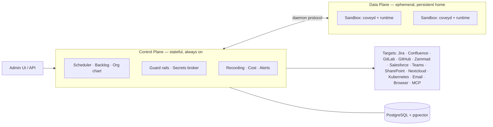

<div align="center">


# covey

**The IT and HR department for AI agents.**

Every agent gets its own sandbox, its own logins and its own backlog.<br/>
You hand out the work, set the limits, and read back what was done.

[](https://covey.work)
[](https://github.com/benjaminLedel/covey/actions/workflows/ci.yml)
[](https://github.com/benjaminLedel/covey/releases/latest)
[](go.mod)
[](LICENSE)

**[covey.work](https://covey.work)** — a live instance, before you install anything

[Deutsch](README.de.md) · **English**

</div>

---


<div align="center">

*Seventeen seconds through the platform: the workforce, an agent's backlog, the recording of a finished run, its wiki memory, the org chart, and what the whole thing costs.*

</div>

---

## What covey is

covey is a self-hosted platform for running AI agents inside a company. You create an agent, give it access to the systems it needs, and it works through a backlog on its own. Everything it does is logged, and everything it costs is counted.

Three examples of what an agent does here:

- **Support** — watches a Zammad queue, answers what it can and escalates the rest.
- **Development** — picks up a Jira ticket, checks out the repository, opens a merge request and links it back on the ticket.
- **QA** — clicks through a web interface in a headless browser and files what breaks.

An agent sleeps until a webhook, a scheduled check or a person wakes it, so an idle agent costs nothing. What it is allowed to reach is decided by the platform, not by the agent's prompt. Its actions and screenshots go into a recording you can read afterwards, spend is broken down per agent and per model, and one button stops every agent in the organisation at once.

covey is built for organisations rather than for one person at a desk. Several people administer it — IT, team leads, security, controlling — permissions and guard rails are set centrally, and humans and agents appear in the same org chart.

**Status:** covey is ready to use. [covey.work](https://covey.work) runs this repository's `main` and is redeployed on every push; releases are versioned, upgrades are documented, and an integration suite covers the whole path from wake to result.

> **Codename.** A *covey* is a small flock that moves together — roughly what the platform does with agents.

<a id="start-in-two-minutes" name="start-in-two-minutes"></a>

## Two minutes to a running instance

**No Go, no Node, no local Postgres.** Docker is all you need:

```bash
git clone https://github.com/benjaminLedel/covey.git && cd covey
cp .env.example .env
echo "COVEY_MASTER_KEY=$(openssl rand -hex 32)" >> .env
make sandbox-images-pull        # the prebuilt workplaces an agent runs in
docker compose up -d --build    # Postgres + covey
```

Open **[http://localhost:8494](http://localhost:8494)** and log in with `admin@covey.local` / `covey-admin`.

The setup asks three things, and you can skip any of them: which engine to use and its credential (it is checked before it is stored), a few sentences about what your company does, and whether you want a **People department** — an agent that writes the configuration for other agents.

For your first agent, go to *New agent → brief* and describe the job in a few sentences. The People department turns that into a configuration you can read through and change before you hire it.

What those five commands set up:

- [`docker-compose.yml`](docker-compose.yml) brings Postgres (pgvector) and the covey binary with the admin UI embedded. Migrations run on start; `bootstrap` creates the organisation, the admin and a demo agent.
- `make sandbox-images-pull` fetches the containers an agent works inside — `base` ([`Dockerfile.sandbox`](Dockerfile.sandbox): Claude Code, chromium, git, ripgrep), `dev` (plus PHP, a JDK and the version managers `fvm`/`uv`) the role workplaces `dev-flutter`, `dev-php` and `dev-web` for agents whose field is settled, and `dev-full` for an installation that would rather not split at all ([`docs/en/operations/workplaces.md`](docs/en/operations/workplaces.md)), for amd64 and arm64, built by [the project's own pipeline](.github/workflows/sandbox-images.yml). `SANDBOX_PROFILES="base dev-web"` pulls only what you need; `make sandbox-images` builds them here instead.

Full walkthrough including your first agent and a production checklist: [`docs/en/getting-started/quickstart.md`](docs/en/getting-started/quickstart.md).

## What you get

| | |
|---|---|
| 🧑‍💼 **An identity per agent** | Its own sandbox, home directory and credentials, and a place on the org chart next to the humans. |
| 🧑‍🎓 **Hiring, not a config form** | Describe the job in a few sentences; the People department writes the configuration and asks back when the brief is thin. What comes out is a draft until a human hires it. |
| 📥 **Backlog and wake sources** | Tasks as first-class objects. Agents wake on a webhook, a heartbeat or a nudge, then go back to sleep. |
| 🔌 **Target systems as plugins** | Jira, Confluence, GitLab, GitHub, Zammad, Salesforce, Teams, SharePoint, Nextcloud, Kubernetes, email (IMAP/SMTP), headless browser, MCP. |
| 🛡️ **Guard rails and approvals** | Enforced centrally, outside the runtime, fail-closed. Critical actions wait for a human. |
| 🔑 **Secrets broker** | No long-lived secret ever enters a sandbox. Access is brokered per run, short-lived and scoped. |
| 🧩 **Skills** | Procedures an agent loads only when they apply — the description stays in context, the instructions are read on demand. |
| 🧠 **Wiki memory** | Linked Markdown pages with a pgvector index instead of flat snippets. Readable, and correctable by hand. |
| 📂 **Workspace** | The agent's home directory in the browser: browse it, drop files in, edit one, pull a selection out as a ZIP. Works while the agent sleeps. |
| 🎥 **Recording and kill switch** | Every run recorded including screenshots, cost per agent and model, one emergency stop for the whole organisation. |
| 📦 **One binary** | Frontend and migrations compiled in. Copy it, run `covey serve` — no nginx, no separate frontend hosting. |

None of these target systems live in this repository. Each one is a separate Go module written against a [public SDK](https://github.com/benjaminLedel/covey-plugin-sdk). The ones covey ships with are in the [plugin pack](https://github.com/benjaminLedel/covey-plugin-pack); the others install at runtime from the [catalogue](https://github.com/benjaminLedel/covey-plugins), without rebuilding anything. Zammad, Kubernetes and the vulnerability databases run as WebAssembly modules from that catalogue, the same way a plugin you write would be installed. There is no privileged tier for the ones we wrote.

## What it looks like


*An organisation's workforce at a glance — state, runtime and budget per agent, and the kill switch for all of them. Above them the **applications**: agents that have been drafted and are waiting to be hired.*

| | |
|---|---|
|  |  |
| **Backlog** — tasks as first-class objects with freely configurable columns; cost, tokens and budget sit in the agent's header. | **Org chart** — humans and agents in the same structure on a zoomable canvas; department, reporting line and lead change in an edit mode, by select or drag & drop. |
|  |  |
| **Memory** — what the agent has learned, readable and editable: add knowledge by hand or make it forget selectively. | **Cost & tokens** — spend over time, broken down by agent and model, for the whole organisation or a single agent. |

## How it works



The **control plane** is always on and holds the state: scheduler, agent registry, backlog, identity and secrets broker, guard rails, observability. The **data plane** is a set of isolated sandboxes with a persistent home directory. A sandbox is disposable — if one is lost it is rebuilt from the config and the home.

Inside each sandbox a small **daemon** speaks a single protocol to the control plane, and an **adapter** starts the actual runtime, currently Claude Code. Because covey manages the sandbox and not the agent framework, replacing the runtime does not touch the rest of the system. Details in [`spec/01-architecture.md`](spec/01-architecture.md).

Most parts of the system have a counterpart in an ordinary company:

| In a company | On the platform |
|---|---|
| Identity / Active Directory | Agent identity (email optional) |
| Workplace / PC | Isolated, persistent sandbox |
| Onboarding / org chart | `SOUL.md` + org structure |
| Workforce & departments | Org-owned agents, teams, cost centres |
| HR / IT administration | Human roles + RBAC + SSO |
| Password vault / PAM | Secrets broker (short-lived tokens) |
| Task list / ticket | Backlog (first-class object) |
| Operations manual / compliance | Central guard rails (platform-enforced) |
| SIEM / EDR | Session recording + alerts + kill switch |

**The stack:**

- One Go binary. API and orchestration run in the same process.
- A React + Tailwind + shadcn/ui frontend, compiled into that binary with `//go:embed`.
- PostgreSQL for everything stateful: backlog, RBAC, the job queue (`SKIP LOCKED`), pub/sub (`LISTEN/NOTIFY`), memory (`pgvector`) and AES-GCM secret columns.
- `builtin` implementations by default. Keycloak, Vault and Redis are supported, never required.

Details in [`spec/10-architecture-stack.md`](spec/10-architecture-stack.md).

## Design principles

1. **The organisation is the unit, not the user.**
2. **The control plane is the product.** Sandboxes are commodity, runtimes are swappable.
3. **Runtime-agnostic.** One daemon protocol plus thin adapters instead of framework lock-in.
4. **Always reachable, compute only on demand.** Idle has to mean idle.
5. **Config as code.** Agent behaviour versioned in Git, changed via PR and review — not via deploy.
6. **Never put long-lived secrets in the sandbox.** Access is brokered at runtime, short-lived and scoped.
7. **Guard rails central and platform-enforced.** Fail-closed, enforced outside the runtime.
8. **Trust by design.** Recording, approvals and the kill switch are prerequisites, not add-ons.
9. **Serial before parallel.** One agent, one task at a time; parallelism means more agents.
10. **Batteries included, but swappable.** Every capability has a simple DB-backed default and a narrow interface for an external provider.

<a id="install" name="install"></a>

## Installing the binary

covey also runs without Docker Compose. The installer picks the binary for your OS and architecture from the [latest release](https://github.com/benjaminLedel/covey/releases/latest), **verifies its SHA-256 checksum** and puts it in `/usr/local/bin`:

```bash
curl -sSL https://raw.githubusercontent.com/benjaminLedel/covey/main/installer/install.sh | sh
```

To read it before running it:

```bash
curl -sSLO https://raw.githubusercontent.com/benjaminLedel/covey/main/installer/install.sh
less install.sh && sh install.sh
```

There are two programs: the control plane (`covey`) and the runner (`covey-runner`), which runs sandboxes on behalf of a server. At a terminal the script asks which one you want; without a terminal it uses the default. You can also say it directly with `--server`, `--runner` or `--all`, pin a version with `--version v0.8.0`, or change the target directory with `--bin-dir ~/bin`.

**Every running instance serves the same script for its own version:**

```bash
curl -sSL https://covey.example/install.sh | sh
```

This is how you add a runner. The instance knows its own version, so you get a runner that speaks the same protocol as the server it will register with. The binaries still come from the GitHub release; the instance decides the version, not the content.

This installs binaries only. The control plane still needs PostgreSQL (with pgvector) and Docker for the sandboxes; the script prints what is left, and [`docs/en/operations/deployment.md`](docs/en/operations/deployment.md) has the full path.

## Documentation

The documentation lives under [`docs/`](docs/) and is the same text the website
serves — one source, editable by pull request. English is that source
(`docs/en/…`); where a German translation exists it sits under the same
relative path in `docs/de/…`, and [`docs/sections.yml`](docs/sections.yml)
holds the reading order. The operating runbooks below are English only.

| Document | Contents |
|---|---|
| [`docs/en/getting-started/quickstart.md`](docs/en/getting-started/quickstart.md) | Compose setup, first agent, production checklist |
| [`docs/en/operations/deployment.md`](docs/en/operations/deployment.md) | CI pipeline, auto-deploy to a target host |
| [`docs/en/operations/upgrade.md`](docs/en/operations/upgrade.md) | Upgrades that need more than a restart — what to build and back up beforehand |
| [`docs/en/operations/api-keys.md`](docs/en/operations/api-keys.md) | API keys: driving covey from outside — what a key may do and what only the browser may |
| [`docs/en/operations/runner.md`](docs/en/operations/runner.md) | Runners: sandboxes on more than one host, the home store, hard egress isolation |
| [`docs/en/operations/workplaces.md`](docs/en/operations/workplaces.md) | Workplaces: which image an agent works in, the role images, a workplace of your own |
| [`docs/en/integrations/zammad.md`](docs/en/integrations/zammad.md) | Zammad: API token, webhook + trigger, customer-visible replies |
| [`docs/en/integrations/github.md`](docs/en/integrations/github.md) | GitHub: issues, pull requests, Actions, checkout inside the sandbox |
| [`docs/en/integrations/gitlab.md`](docs/en/integrations/gitlab.md) | GitLab: issues, merge requests, checkout inside the sandbox |
| [`docs/en/integrations/jira.md`](docs/en/integrations/jira.md) | Jira: the ticket beside the repository — Cloud and Data Center, the workflow, the heartbeat gate |
| [`docs/en/integrations/confluence.md`](docs/en/integrations/confluence.md) | Confluence: documentation as context and as a place to write results |
| [`docs/en/integrations/email.md`](docs/en/integrations/email.md) | An email mailbox as a wake source (IMAP/SMTP) |
| [`docs/en/integrations/teams.md`](docs/en/integrations/teams.md) | Microsoft Teams as the channel between human and agent |
| [`docs/en/integrations/sharepoint.md`](docs/en/integrations/sharepoint.md) | SharePoint / Teams files via Microsoft Graph |
| [`docs/en/integrations/nextcloud.md`](docs/en/integrations/nextcloud.md) | Nextcloud files via WebDAV |
| [`docs/en/integrations/browser.md`](docs/en/integrations/browser.md) | Headless Chrome: driving web UIs, screenshots into the recording |
| [`docs/en/integrations/vulndb.md`](docs/en/integrations/vulndb.md) | Known vulnerabilities in package dependencies (npm, Composer, Dart/Flutter) |
| [`docs/en/integrations/kubernetes.md`](docs/en/integrations/kubernetes.md) | Reading a Kubernetes cluster: ServiceAccount, token, cluster CA |

The full specification is in [`spec/`](spec/) — start at [`spec/README.md`](spec/README.md).

<details>
<summary><b>Running an instance: what an update needs</b></summary>

<br/>

The platform half of the system prompt (completion protocol, `covey/` meta actions, stage rules) is compiled at dispatch time and ships with the binary — **nothing** to do there after an update. The **agent config** is written by humans and stays exactly as it is. `covey config lint` says which agents should be brought along, and why:

```bash
covey config lint          # changes nothing, only reports
covey config lint --json   # machine-readable
```

- **Heartbeat interval too short** for that agent's target systems (cloning a repository every two minutes is a different proposition from checking a mailbox).
- **No visible trace:** a GitLab-gated heartbeat where no playbook step comments — the item counts as untouched at the next interval and keeps waking the agent forever.
- **`blocked` on a polling target system** that has no webhook to ever wake the task again.
- **Board columns** that name an item rather than a state of work (`#83 CSV import`), or simply too many of them.
- **Frequent turn-limit aborts** — the assignment is cut too large, or `max_turns` is too small.

Exit code 1 when there are findings, so an upgrade script can react to it. Changes go through the config tab in the UI or `POST /api/v1/agents/{id}/config/import` — both versioned.

**Which build is running?** `covey version` prints version, commit and build time — the same information appears in the `covey serve` startup line, at `GET /api/v1/version` (session required) and at the bottom of the sidebar in the UI. Inside a sandbox, `coveyd version` answers the same for the sandbox image.

</details>

<details>
<summary><b>Development</b></summary>

<br/>

```bash
make dev-db       # Postgres (pgvector) via Docker on port 5433
make bootstrap    # build frontend + binaries, migrate, create org/admin/agent
make run          # covey serve on http://localhost:8494
```

**Login.** `admin@covey.local` / `covey-admin`, overridable via `COVEY_ADMIN_EMAIL` / `COVEY_ADMIN_PASSWORD` at bootstrap time.

**Runtime access.** For the Claude Code runtime to do any work, one of these secrets must be set:

| Secret | Purpose |
|---|---|
| `anthropic_api_key` | API key (pay as you go) |
| `claude_code_oauth_token` | Subscription account — generate the token once with `claude setup-token` |

Without either, tasks fail with "Not logged in · Please run /login": the sandbox has its own empty `HOME`, so your local `claude` login is not visible in there.

**Sandbox isolation.** The control plane starts sandboxes as containers (**docker provider**, the default) — real isolation at the container level. `make sandbox-image` builds the `base` profile ([`Dockerfile.sandbox`](Dockerfile.sandbox)), `make sandbox-image-dev` the `dev` one, and beside them stand the role workplaces `dev-flutter`, `dev-php` and `dev-web` ([`docs/en/operations/workplaces.md`](docs/en/operations/workplaces.md)). **The image hangs off the agent**, not off the instance: a support or mail agent runs on `base` and no longer carries a developer agent's JVM, and a Flutter agent no longer carries a database server. The profile is set per agent in the interface, and an image of your own is a valid value there. `COVEY_SANDBOX_IMAGE_<PROFILE>` overrides what a profile resolves to. The rule when extending them: **version → home, toolchain → image** — SDK versions are fetched by the agent itself into its persistent home, following the pin in the project repo. A role workplace is where that rule is deliberately reversed: for an agent whose field is settled the version is settled too, so `dev-flutter` carries its baseline SDK in the image.

**Tests.** `make test` (unit) and `make test-integration` (the full end-to-end path against the dev DB, with a mock runtime and a fake Zammad; it skips when port 5433 is unreachable). For demos without a real Zammad: run `go run ./demo/fakezammad`, then set the secrets `zammad_url` = `http://localhost:9999` and `zammad_token` (any value).

**CI.** Every push and pull request runs format checks, `go vet`, the Go and frontend test suites, `govulncheck` and CodeQL — on GitHub via [Actions](.github/workflows/), on GitLab via the pipeline. Every push to `main` also rolls covey out to a target host (`test → build → deploy`), which is how [covey.work](https://covey.work) stays current. See [`docs/en/operations/deployment.md`](docs/en/operations/deployment.md).

</details>

<details>
<summary><b>Repository layout and the specification</b></summary>

<br/>

| Path | Contents |
|---|---|
| [`spec/`](spec/) | The full specification (start at [`spec/README.md`](spec/README.md)) |
| [`docs/`](docs/) | Operations and integration runbooks |
| `cmd/covey/` | Control-plane binary: `serve`, `migrate`, `bootstrap`, `passwd`, `genkey` |
| `cmd/coveyd/` | Sandbox daemon (speaks the daemon protocol, bootstraps the runtime) |
| `cmd/covey-runner/` | The remote runner: speaks the runner protocol, no database access |
| `internal/` | Orchestrator, agents, backlog, identity/secrets, guard rails, observability, memory, egress, org, templates, the plugin machinery (`target/`: manifest engine, wasm runtime, MCP, per-org activation), HTTP API |
| `migrations/` | Versioned SQL migrations (embedded via `//go:embed`) |
| `web/` | React/Vite/Tailwind admin UI (`dist/` gets embedded) |
| `skills/covey-agent/` | Claude Code skill for building and updating covey agents |
| [`examples/`](examples/) | Ready-made agent bundles: coding agent, QA agent, web researcher, log triage |
| `demo/fakezammad/` | Minimal Zammad double for local demos |
| `demo/seed/`, `demo/tour/` | The demo organisation behind the screenshots above, and the program that re-records them |
| `mockup/` | Static HTML mockup of the admin interface |

| Spec file | Contents |
|---|---|
| [`spec/01-architecture.md`](spec/01-architecture.md) | System overview, control/data plane, runtime abstraction, daemon protocol |
| [`spec/02-agent-model.md`](spec/02-agent-model.md) | The agent as an entity: identity, sandbox, access, config as code, org chart |
| [`spec/03-lifecycle-scheduling.md`](spec/03-lifecycle-scheduling.md) | State machine, dispatch loop, wake sources, backlog, blocking, correlation |
| [`spec/04-identity-secrets.md`](spec/04-identity-secrets.md) | Keycloak, RFC 8693 token exchange, secrets broker, threat model |
| [`spec/05-memory.md`](spec/05-memory.md) | Memory layers, LLM wiki (Markdown + pgvector), persistent home |
| [`spec/06-observability-control.md`](spec/06-observability-control.md) | Guard rails, session recording, approval gates, kill switch, cost, supervisor |
| [`spec/07-open-decisions.md`](spec/07-open-decisions.md) | Open questions, build vs. buy, MVP scope |
| [`spec/08-market.md`](spec/08-market.md) | Market research: competitors, open-source building blocks, build vs. adopt |
| [`spec/09-enterprise-model.md`](spec/09-enterprise-model.md) | The organisation as the unit: roles & RBAC, SSO, tenants, cost centres, compliance |
| [`spec/10-architecture-stack.md`](spec/10-architecture-stack.md) | Frontend, backend language, "batteries included, but swappable", the Postgres anchor |
| [`spec/11-mvp-plan.md`](spec/11-mvp-plan.md) | Build order M0–M7, critical path, acceptance checklist |
| [`spec/12-claude-code-adapter.md`](spec/12-claude-code-adapter.md) | First runtime adapter: Claude Code headless via `claude -p` |
| [`spec/13-zammad-integration.md`](spec/13-zammad-integration.md) | Target system Zammad: wake via webhook, REST actions, `blocked`↔`pending` |
| [`spec/14-companion-memory.md`](spec/14-companion-memory.md) | Companion: brain dump & context from what the humans know |
| [`spec/15-teams-integration.md`](spec/15-teams-integration.md) | Microsoft Teams as a target system: OAuth2/JWT, chat as the channel |
| [`spec/16-runner.md`](spec/16-runner.md) | Distributed data plane: registered runners, the central home store, sandbox images per agent |

</details>

## Contributing

Changes to concept and architecture go through the spec: proposals as a merge request against [`spec/`](spec/), open points discussed in [`spec/07-open-decisions.md`](spec/07-open-decisions.md). For code the rule is thinnest vertical slice first, `builtin` as the default, and the interface before the implementation. See [`CONTRIBUTING.md`](CONTRIBUTING.md).

## Licence

Copyright (C) 2026 Benjamin Ledel

covey is free software under the [GNU Affero General Public License v3.0](LICENSE). You may run it, study it, modify it and pass it on. The one obligation that matters in practice: if you offer a modified covey to others over a network, those users must be able to get your modified source under the same terms.

Self-hosting covey inside your own organisation triggers nothing — running it, however you have configured it, is simply using the software.
