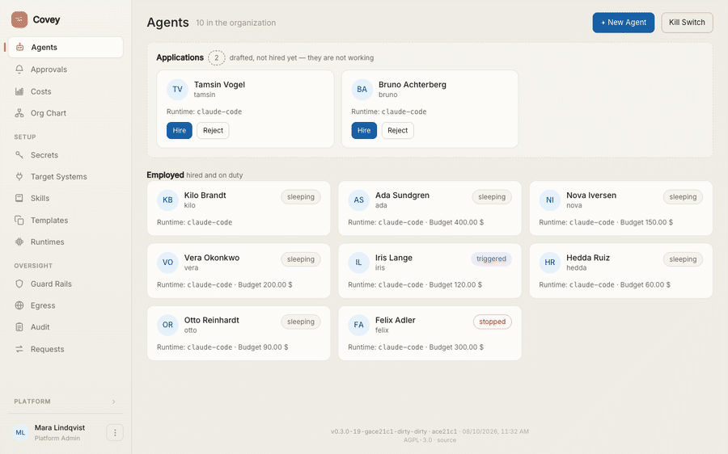
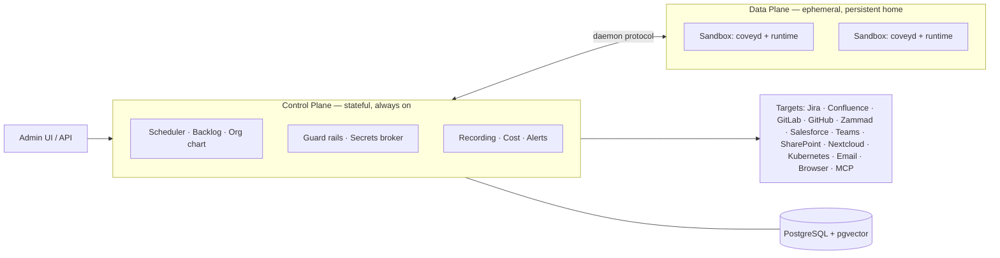

<div align="center">


# Covey

**The IT and HR department for AI agents.**

An agent gets an identity, a locked-down workplace, credentials it never keeps,<br/>
a backlog and a place on the org chart. You get to see everything it did.

[](https://covey.work)
[](https://github.com/benjaminLedel/covey/actions/workflows/ci.yml)
[](https://github.com/benjaminLedel/covey/releases/latest)
[](go.mod)
[](LICENSE)

**[covey.work](https://covey.work)** — a live instance, before you install anything

[Deutsch](README.de.md) · **English**

</div>

---



<div align="center">

*Seventeen seconds through the platform: the workforce, an agent's backlog, the recording of a finished run, its wiki memory, the org chart, and what the whole thing costs.*

</div>

---

## What Covey is

An agent that does real work needs what a new colleague needs: an account, a machine, access to the systems the work happens in, a list of what to do, and somebody who notices when it goes wrong.

Most agent frameworks hand you the model and leave the rest to you. Covey is the rest.

- A **support agent** watches a Zammad queue, answers what it can and escalates the rest.
- A **developer agent** takes a Jira ticket, checks out the repository, opens a merge request and comments the link back on the ticket.
- A **QA agent** drives your web UI in a headless browser and files what it finds.

They sleep until something wakes them — a webhook, a heartbeat, a person. Every run is recorded with screenshots. The bill is on one page, per agent and per model. One switch stops all of them.

**The unit is the organisation, not the user.** This is the platform a *company* runs to govern its entire agent workforce: many human stakeholders (IT, team leads, security, audit, controlling), guard rails enforced centrally, and one org chart with humans and agents in it. That is the difference from the single-user "AI employee" apps.

**Where it stands:** well beyond the MVP. The end-to-end path from [`spec/11-mvp-plan.md`](spec/11-mvp-plan.md) is in place and everything on this page is built on top of it; the acceptance checklist runs as an integration test suite. [covey.work](https://covey.work) is this repository's `main`, deployed on every push.

> **Codename.** A *covey* is a small, coordinated flock — a group that moves together. That is the platform: many agents, centrally orchestrated.

<a id="start-in-two-minutes" name="start-in-two-minutes"></a>

## Two minutes to a running instance

**No Go, no Node, no local Postgres.** Docker is all you need:

```bash
git clone https://github.com/benjaminLedel/covey.git && cd covey
cp .env.example .env
echo "COVEY_MASTER_KEY=$(openssl rand -hex 32)" >> .env
make sandbox-images-pull        # the two prebuilt workplaces an agent runs in
docker compose up -d --build    # Postgres + Covey
```

Open **[http://localhost:8494](http://localhost:8494)** and log in with `admin@covey.local` / `covey-admin`.

Setup asks three questions, each one skippable: the engine and its credential (checked before it is stored), three sentences on what your company does, and whether you want a **People department** — an agent whose job is drafting the others. Then *New agent → brief* is the shortest way to your first colleague: describe in a few sentences what they should do, and the People department writes the configuration.

Two notes on what those five lines do:

- [`docker-compose.yml`](docker-compose.yml) brings Postgres (pgvector) and the covey binary with the admin UI embedded. Migrations run on start; `bootstrap` creates the organisation, the admin and a demo agent.
- `make sandbox-images-pull` fetches the containers an agent works inside — `base` ([`Dockerfile.sandbox`](Dockerfile.sandbox): Claude Code, chromium, git, ripgrep) and `dev` (plus PHP, a JDK and the version managers `fvm`/`uv`), for amd64 and arm64, built by [the project's own pipeline](.github/workflows/sandbox-images.yml). `make sandbox-images` builds them here instead.

Full walkthrough including your first agent and a production checklist: [`docs/quickstart-docker.md`](docs/quickstart-docker.md).

## What you get

| | |
|---|---|
| 🧑‍💼 **An identity per agent** | Own sandbox, own home directory, own credentials — and a place on the org chart beside the humans. |
| 🧑‍🎓 **Hiring, not a config form** | Describe the job in a few sentences; the People department writes the configuration and asks back when the brief is thin. What comes out is a draft until a human hires it. |
| 📥 **Backlog and wake sources** | Tasks as first-class objects. Agents wake on a webhook, a heartbeat or a nudge, then go back to sleep. |
| 🔌 **Target systems as plugins** | Jira, Confluence, GitLab, GitHub, Zammad, Salesforce, Teams, SharePoint, Nextcloud, Kubernetes, email (IMAP/SMTP), headless browser, MCP. |
| 🛡️ **Guard rails and approvals** | Enforced centrally, outside the runtime, fail-closed. Critical actions wait for a human. |
| 🔑 **Secrets broker** | No long-lived secret ever enters a sandbox. Access is brokered per run, short-lived and scoped. |
| 🧩 **Skills** | Procedures an agent loads only when they apply — the description stays in context, the instructions are read on demand. |
| 🧠 **Wiki memory** | Linked Markdown pages with a pgvector index instead of flat snippets. Readable, and correctable by hand. |
| 📂 **Workspace** | The agent's home directory in the browser: browse it, drop files in, edit one, pull a selection out as a ZIP. Works while the agent sleeps. |
| 🎥 **Recording and kill switch** | Every run recorded including screenshots, cost per agent and model, one emergency stop for the whole organisation. |
| 📦 **One binary** | Frontend and migrations compiled in. Copy it, run `covey serve` — no nginx, no separate frontend hosting. |

**Plugins are nobody's privilege.** None of those target systems live in this repository. They are separate modules against a [public SDK](https://github.com/benjaminLedel/covey-plugin-sdk); the ones Covey ships with sit in the [plugin pack](https://github.com/benjaminLedel/covey-plugin-pack), and the rest install from the [catalogue](https://github.com/benjaminLedel/covey-plugins) at runtime. Zammad, Kubernetes and the vulnerability databases are compiled WebAssembly from that same catalogue — on exactly the footing a plugin of yours would have.

## What it looks like


*An organisation's workforce at a glance — state, runtime and budget per agent, and the kill switch for all of them. Above them the **applications**: agents that have been drafted and are waiting to be hired.*

| | |
|---|---|
|  |  |
| **Backlog** — tasks as first-class objects with freely configurable columns; cost, tokens and budget sit in the agent's header. | **Org chart** — humans and agents in the same structure; department and reporting line via drag & drop. |
|  |  |
| **Memory** — what the agent has learned, readable and editable: add knowledge by hand or make it forget selectively. | **Cost & tokens** — spend over time, broken down by agent and model, for the whole organisation or a single agent. |

## How it works



The **control plane** is stateful and always on: scheduler, agent registry, backlog, identity and secrets broker, guard rails, observability. The **data plane** is a set of isolated, ephemeral sandboxes with a persistent home — lose one and it is rebuilt from config plus home.

Each sandbox runs a slim **daemon** that speaks one uniform protocol, and a thin **adapter** bootstraps the concrete runtime inside it (Claude Code today). Covey manages the sandbox, not the framework. That is what keeps the runtime swappable. Details in [`spec/01-architecture.md`](spec/01-architecture.md).

Nearly every component has a counterpart in a real company, which is also the fastest way to read the system:

| In a company | On the platform |
|---|---|
| Identity / Active Directory | Agent identity (email optional) |
| Workplace / PC | Isolated, persistent sandbox |
| Onboarding / org chart | `SOUL.md` + org structure |
| Workforce & departments | Org-owned agents, teams, cost centres |
| HR / IT administration | Human roles + RBAC + SSO |
| Password vault / PAM | Secrets broker (short-lived tokens) |
| Task list / ticket | Backlog (first-class object) |
| Operations manual / compliance | Central guard rails (platform-enforced) |
| SIEM / EDR | Session recording + alerts + kill switch |

**The stack**, in four lines: a single Go binary (API and orchestration in one process); a React + Tailwind + shadcn/ui frontend baked in via `//go:embed`; PostgreSQL as the anchor for state, backlog, RBAC, the job queue (`SKIP LOCKED`), pub/sub (`LISTEN/NOTIFY`), memory (`pgvector`) and AES-GCM secret columns; and `builtin` everywhere by default — Keycloak, Vault and Redis are optional, never prerequisites. Details in [`spec/10-architecture-stack.md`](spec/10-architecture-stack.md).

## Design principles

1. **The organisation is the unit, not the user.**
2. **The control plane is the product.** Sandboxes are commodity, runtimes are swappable.
3. **Runtime-agnostic.** One daemon protocol plus thin adapters instead of framework lock-in.
4. **Always reachable, compute only on demand.** Idle has to mean idle.
5. **Config as code.** Agent behaviour versioned in Git, changed via PR and review — not via deploy.
6. **Never put long-lived secrets in the sandbox.** Access is brokered at runtime, short-lived and scoped.
7. **Guard rails central and platform-enforced.** Fail-closed, enforced outside the runtime.
8. **Trust by design.** Recording, approvals and the kill switch are prerequisites, not add-ons.
9. **Serial before parallel.** One agent, one task at a time; parallelism means more agents.
10. **Batteries included, but swappable.** Every capability has a simple DB-backed default and a narrow interface for an external provider.

<a id="install" name="install"></a>

## Installing the binary

Covey also runs without Docker Compose. The installer picks the binary for your OS and architecture from the [latest release](https://github.com/benjaminLedel/covey/releases/latest), **verifies its SHA-256 checksum** and puts it in `/usr/local/bin`:

```bash
curl -sSL https://raw.githubusercontent.com/benjaminLedel/covey/main/installer/install.sh | sh
```

To read the script first — a reasonable thing to want — fetch it separately:

```bash
curl -sSLO https://raw.githubusercontent.com/benjaminLedel/covey/main/installer/install.sh
less install.sh && sh install.sh
```

There are two programs: the control plane (`covey`) and the runner (`covey-runner`, which executes sandboxes for a server). At a terminal the script asks which one you want; in a pipeline it takes the default rather than waiting for an answer nobody can give. Say it outright with `--server`, `--runner` or `--all`; pin a version with `--version v0.8.0`, change the target with `--bin-dir ~/bin`.

**Every running instance serves the same script for its own version:**

```bash
curl -sSL https://covey.example/install.sh | sh
```

That is the way to add a runner: the instance knows its version, so the runner you get speaks the same protocol as the server it registers with. The binaries still come from the GitHub release — the instance decides the version, not the content.

This installs binaries only. The control plane still needs PostgreSQL (with pgvector) and Docker for the sandboxes; the script prints what is left, and [`docs/ops-deployment.md`](docs/ops-deployment.md) has the full path.

## Documentation

All runbooks are in English.

| Document | Contents |
|---|---|
| [`docs/quickstart-docker.md`](docs/quickstart-docker.md) | Compose setup, first agent, production checklist |
| [`docs/ops-deployment.md`](docs/ops-deployment.md) | CI pipeline, auto-deploy to a target host |
| [`docs/upgrade.md`](docs/upgrade.md) | Upgrades that need more than a restart — what to build and back up beforehand |
| [`docs/api-keys.md`](docs/api-keys.md) | API keys: driving Covey from outside — what a key may do and what only the browser may |
| [`docs/ops-runner.md`](docs/ops-runner.md) | Runners: sandboxes on more than one host, the home store, hard egress isolation |
| [`docs/ops-zammad.md`](docs/ops-zammad.md) | Zammad: API token, webhook + trigger, customer-visible replies |
| [`docs/ops-github.md`](docs/ops-github.md) | GitHub: issues, pull requests, Actions, checkout inside the sandbox |
| [`docs/ops-gitlab.md`](docs/ops-gitlab.md) | GitLab: issues, merge requests, checkout inside the sandbox |
| [`docs/ops-jira.md`](docs/ops-jira.md) | Jira: the ticket beside the repository — Cloud and Data Center, the workflow, the heartbeat gate |
| [`docs/ops-confluence.md`](docs/ops-confluence.md) | Confluence: documentation as context and as a place to write results |
| [`docs/ops-email.md`](docs/ops-email.md) | An email mailbox as a wake source (IMAP/SMTP) |
| [`docs/ops-teams.md`](docs/ops-teams.md) | Microsoft Teams as the channel between human and agent |
| [`docs/ops-sharepoint.md`](docs/ops-sharepoint.md) | SharePoint / Teams files via Microsoft Graph |
| [`docs/ops-nextcloud.md`](docs/ops-nextcloud.md) | Nextcloud files via WebDAV |
| [`docs/ops-browser.md`](docs/ops-browser.md) | Headless Chrome: driving web UIs, screenshots into the recording |
| [`docs/ops-vulndb.md`](docs/ops-vulndb.md) | Known vulnerabilities in package dependencies (npm, Composer, Dart/Flutter) |
| [`docs/ops-k8s.md`](docs/ops-k8s.md) | Reading a Kubernetes cluster: ServiceAccount, token, cluster CA |

The full specification is in [`spec/`](spec/) — start at [`spec/README.md`](spec/README.md).

<details>
<summary><b>Running an instance: what an update needs</b></summary>

<br/>

The platform half of the system prompt (completion protocol, `covey/` meta actions, stage rules) is compiled at dispatch time and ships with the binary — **nothing** to do there after an update. The **agent config** is written by humans and stays exactly as it is. `covey config lint` says which agents should be brought along, and why:

```bash
covey config lint          # changes nothing, only reports
covey config lint --json   # machine-readable
```

- **Heartbeat interval too short** for that agent's target systems (cloning a repository every two minutes is a different proposition from checking a mailbox).
- **No visible trace:** a GitLab-gated heartbeat where no playbook step comments — the item counts as untouched at the next interval and keeps waking the agent forever.
- **`blocked` on a polling target system** that has no webhook to ever wake the task again.
- **Board columns** that name an item rather than a state of work (`#83 CSV import`), or simply too many of them.
- **Frequent turn-limit aborts** — the assignment is cut too large, or `max_turns` is too small.

Exit code 1 when there are findings, so an upgrade script can react to it. Changes go through the config tab in the UI or `POST /api/v1/agents/{id}/config/import` — both versioned.

**Which build is running?** `covey version` prints version, commit and build time — the same information appears in the `covey serve` startup line, at `GET /api/v1/version` (session required) and at the bottom of the sidebar in the UI. Inside a sandbox, `coveyd version` answers the same for the sandbox image.

</details>

<details>
<summary><b>Development</b></summary>

<br/>

```bash
make dev-db       # Postgres (pgvector) via Docker on port 5433
make bootstrap    # build frontend + binaries, migrate, create org/admin/agent
make run          # covey serve on http://localhost:8494
```

**Login.** `admin@covey.local` / `covey-admin`, overridable via `COVEY_ADMIN_EMAIL` / `COVEY_ADMIN_PASSWORD` at bootstrap time.

**Runtime access.** For the Claude Code runtime to do any work, one of these secrets must be set:

| Secret | Purpose |
|---|---|
| `anthropic_api_key` | API key (pay as you go) |
| `claude_code_oauth_token` | Subscription account — generate the token once with `claude setup-token` |

Without either, tasks fail with "Not logged in · Please run /login": the sandbox has its own empty `HOME`, so your local `claude` login is not visible in there.

**Sandbox isolation.** The control plane starts sandboxes as containers (**docker provider**, the default) — real isolation at the container level. `make sandbox-image` builds the `base` profile ([`Dockerfile.sandbox`](Dockerfile.sandbox)), `make sandbox-image-dev` the `dev` one ([`Dockerfile.sandbox.dev`](Dockerfile.sandbox.dev)). **The image hangs off the agent**, not off the instance: a support or mail agent runs on `base` and no longer carries a developer agent's JVM. The profile is set per agent in the interface, and an image of your own is a valid value there. `COVEY_SANDBOX_IMAGE` / `COVEY_SANDBOX_IMAGE_DEV` override what the two profiles resolve to. The rule when extending them: **version → home, toolchain → image** — SDK versions are fetched by the agent itself into its persistent home, following the pin in the project repo ([`docs/ops-deployment.md`](docs/ops-deployment.md)).

**Tests.** `make test` (unit) and `make test-integration` (the full end-to-end path against the dev DB, with a mock runtime and a fake Zammad; it skips when port 5433 is unreachable). For demos without a real Zammad: run `go run ./demo/fakezammad`, then set the secrets `zammad_url` = `http://localhost:9999` and `zammad_token` (any value).

**CI.** Every push and pull request runs format checks, `go vet`, the Go and frontend test suites, `govulncheck` and CodeQL — on GitHub via [Actions](.github/workflows/), on GitLab via the pipeline. Every push to `main` also rolls Covey out to a target host (`test → build → deploy`), which is how [covey.work](https://covey.work) stays current. See [`docs/ops-deployment.md`](docs/ops-deployment.md).

</details>

<details>
<summary><b>Repository layout and the specification</b></summary>

<br/>

| Path | Contents |
|---|---|
| [`spec/`](spec/) | The full specification (start at [`spec/README.md`](spec/README.md)) |
| [`docs/`](docs/) | Operations and integration runbooks |
| `cmd/covey/` | Control-plane binary: `serve`, `migrate`, `bootstrap`, `passwd`, `genkey` |
| `cmd/coveyd/` | Sandbox daemon (speaks the daemon protocol, bootstraps the runtime) |
| `cmd/covey-runner/` | The remote runner: speaks the runner protocol, no database access |
| `internal/` | Orchestrator, agents, backlog, identity/secrets, guard rails, observability, memory, egress, org, templates, the plugin machinery (`target/`: manifest engine, wasm runtime, MCP, per-org activation), HTTP API |
| `migrations/` | Versioned SQL migrations (embedded via `//go:embed`) |
| `web/` | React/Vite/Tailwind admin UI (`dist/` gets embedded) |
| `skills/covey-agent/` | Claude Code skill for building and updating Covey agents |
| [`examples/`](examples/) | Ready-made agent bundles: coding agent, QA agent, web researcher, log triage |
| `demo/fakezammad/` | Minimal Zammad double for local demos |
| `demo/seed/`, `demo/tour/` | The demo organisation behind the screenshots above, and the program that re-records them |
| `mockup/` | Static HTML mockup of the admin interface |

| Spec file | Contents |
|---|---|
| [`spec/01-architecture.md`](spec/01-architecture.md) | System overview, control/data plane, runtime abstraction, daemon protocol |
| [`spec/02-agent-model.md`](spec/02-agent-model.md) | The agent as an entity: identity, sandbox, access, config as code, org chart |
| [`spec/03-lifecycle-scheduling.md`](spec/03-lifecycle-scheduling.md) | State machine, dispatch loop, wake sources, backlog, blocking, correlation |
| [`spec/04-identity-secrets.md`](spec/04-identity-secrets.md) | Keycloak, RFC 8693 token exchange, secrets broker, threat model |
| [`spec/05-memory.md`](spec/05-memory.md) | Memory layers, LLM wiki (Markdown + pgvector), persistent home |
| [`spec/06-observability-control.md`](spec/06-observability-control.md) | Guard rails, session recording, approval gates, kill switch, cost, supervisor |
| [`spec/07-open-decisions.md`](spec/07-open-decisions.md) | Open questions, build vs. buy, MVP scope |
| [`spec/08-market.md`](spec/08-market.md) | Market research: competitors, open-source building blocks, build vs. adopt |
| [`spec/09-enterprise-model.md`](spec/09-enterprise-model.md) | The organisation as the unit: roles & RBAC, SSO, tenants, cost centres, compliance |
| [`spec/10-architecture-stack.md`](spec/10-architecture-stack.md) | Frontend, backend language, "batteries included, but swappable", the Postgres anchor |
| [`spec/11-mvp-plan.md`](spec/11-mvp-plan.md) | Build order M0–M7, critical path, acceptance checklist |
| [`spec/12-claude-code-adapter.md`](spec/12-claude-code-adapter.md) | First runtime adapter: Claude Code headless via `claude -p` |
| [`spec/13-zammad-integration.md`](spec/13-zammad-integration.md) | Target system Zammad: wake via webhook, REST actions, `blocked`↔`pending` |
| [`spec/14-companion-memory.md`](spec/14-companion-memory.md) | Companion: brain dump & context from what the humans know |
| [`spec/15-teams-integration.md`](spec/15-teams-integration.md) | Microsoft Teams as a target system: OAuth2/JWT, chat as the channel |
| [`spec/16-runner.md`](spec/16-runner.md) | Distributed data plane: registered runners, the central home store, sandbox images per agent |

</details>

## Contributing

Changes to concept and architecture go through the spec: proposals as a merge request against [`spec/`](spec/), open points discussed in [`spec/07-open-decisions.md`](spec/07-open-decisions.md). For code, the build order from the MVP plan applies — thinnest vertical slice first, `builtin` as the default, interface before implementation. See [`CONTRIBUTING.md`](CONTRIBUTING.md).

## Licence

Copyright (C) 2026 Benjamin Ledel

Covey is free software under the [GNU Affero General Public License v3.0](LICENSE). You may run it, study it, modify it and pass it on. The one obligation that matters in practice: if you offer a modified Covey to others over a network, those users must be able to get your modified source under the same terms.

Self-hosting Covey inside your own organisation triggers nothing — running it, however you have configured it, is simply using the software.
