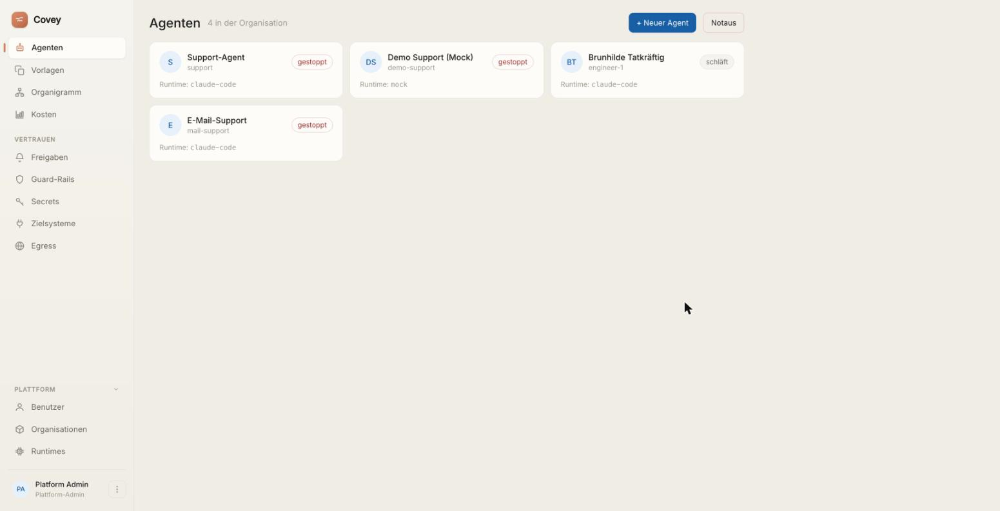
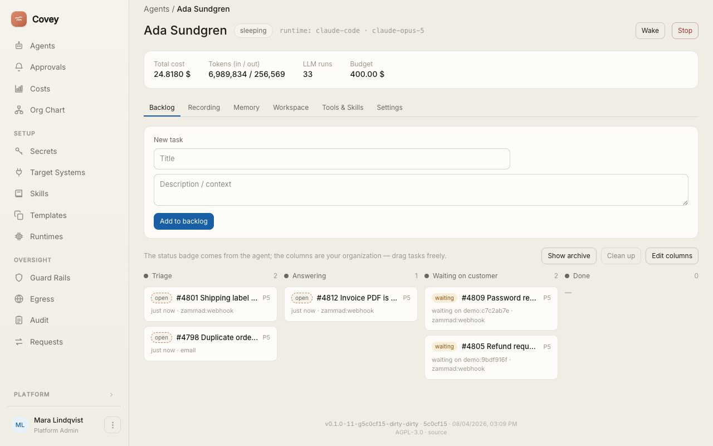
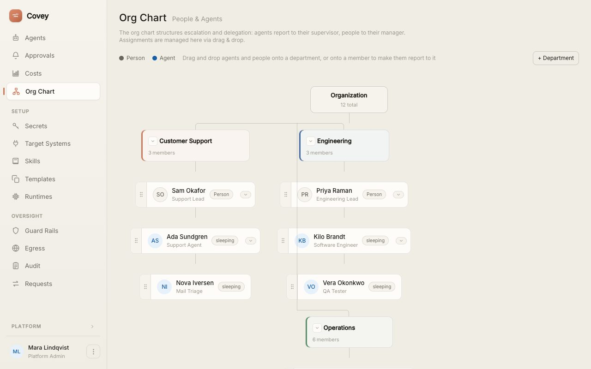
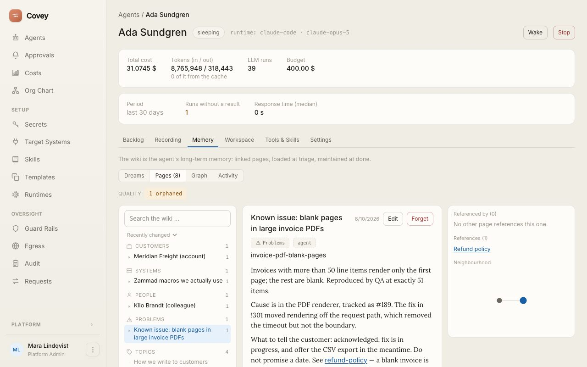
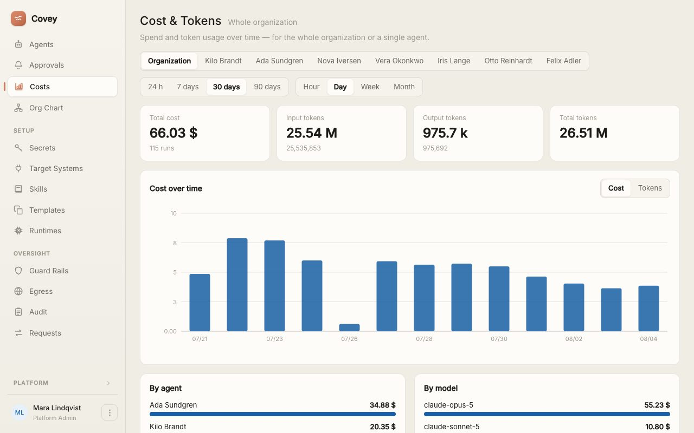
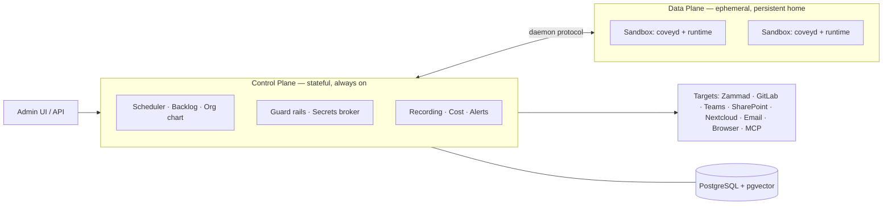

<div align="center">


# Covey

**The IT and HR department for AI agents.**

A platform that manages AI agents like employees — with an identity, a workplace,<br/>
credentials, a backlog and a manager. Plus the tooling to supervise them.

[](https://covey.work)
[](go.mod)
[](migrations/)
[](#stack)
[](spec/12-claude-code-adapter.md)

**[covey.work](https://covey.work)** — the platform, live

[Deutsch](README.de.md) · **English**

</div>

---

> **Codename: Covey.** A *covey* is a small, coordinated flock — a group that moves together. That is exactly what this platform is: many agents, centrally orchestrated.

**Covey's unit is the organisation, not the individual user.** That is the load-bearing distinction from single-user "AI employee" apps: Covey is the platform a *company* operates to manage and govern its entire agent workforce — with many human stakeholders (IT, team leads, security/compliance, audit, controlling), central governance and a company-wide org chart.

> **A note on language:** the UI, the specification in [`spec/`](spec/) and the runbooks in [`docs/`](docs/) are written in **German**. This README is the English entry point; the German one lives at [`README.de.md`](README.de.md).

## The interface



*An organisation's workforce at a glance — state (`gestoppt` = stopped, `schläft` = sleeping), the runtime per agent, and the kill switch for all of them.*

| | |
|---|---|
|  |  |
| **Backlog** — tasks as first-class objects with freely configurable columns; cost, tokens and budget sit in the agent's header. | **Org chart** — humans and agents in the same structure; department and reporting line via drag & drop. |
|  |  |
| **Memory** — what the agent has learned, readable and editable: add knowledge by hand or make it forget selectively. | **Cost & tokens** — spend over time, broken down by agent and model, for the whole organisation or a single agent. |

## Up and running in two minutes

Want a look first? The running instance lives at **[covey.work](https://covey.work)** — it is redeployed automatically on every push to `main`.

Running it yourself needs **no Go, no Node, no local Postgres** — Docker is all you need:

```bash
cp .env.example .env
echo "COVEY_MASTER_KEY=$(openssl rand -hex 32)" >> .env   # 32-byte key
docker compose up -d --build                              # start Postgres + Covey
```

Then open [http://localhost:8494](http://localhost:8494) — log in with `admin@covey.local` / `covey-admin`. A **first steps** checklist on the agent overview walks you to your first working agent; it reads your organisation's actual state, ticks itself off and disappears once you are done.

The bundled [`docker-compose.yml`](docker-compose.yml) brings Postgres (pgvector) and the covey binary with its embedded admin UI; `bootstrap` creates the organisation, the admin and a demo agent, and migrations run automatically. Full walkthrough including your first agent and a production checklist: [`docs/schnellstart-docker.md`](docs/schnellstart-docker.md) (German).

## What's inside

| | |
|---|---|
| 🧑‍💼 **Agents with an identity** | Their own sandbox, their own home directory, their own credentials — and a place on the org chart next to the humans. |
| 📥 **Backlog & wake sources** | Tasks as first-class objects; agents wake on a webhook, a heartbeat or a nudge, then go back to sleep. |
| 🔌 **Target systems as plugins** | Zammad, GitLab, Microsoft Teams, SharePoint, Nextcloud, email (IMAP/SMTP), headless browser, MCP — each driven by a manifest, no special case in the core. |
| 🛡️ **Guard rails & approvals** | Enforced centrally, outside the runtime, fail-closed. Critical actions go to a human first. |
| 🔑 **Secrets broker** | No long-lived secrets inside the sandbox — access is brokered at runtime, short-lived and scoped. |
| 🧩 **Skills** | Procedures an agent loads only when they apply: the description stays in context, the instructions and any extra files are read on demand. Kept in an org-wide library, linked per agent — a delivery lead run that finds nothing to do no longer pays for five playbooks. |
| 🧠 **Wiki memory** | Linked Markdown pages with a pgvector index instead of flat snippets — readable, and correctable by hand. |
| 📂 **Workspace** | The agent's home directory in the browser: look through what it has lying around, drop a template, a dataset or a whole folder in, edit a file, pull a selection back out as a ZIP. Markdown, images, PDFs and tables are previewed in place. Works while the agent sleeps, and every change is recorded. |
| 🎥 **Recording & kill switch** | Every run recorded including screenshots; cost per agent and model; an emergency stop for the entire organisation. |
| 📦 **One binary** | Frontend and migrations are compiled in. Copy it, run `covey serve` — no nginx, no separate frontend hosting. |

**CI:** every push and pull request runs format checks, `go vet`, the Go and frontend test suites, `govulncheck` and CodeQL — on GitHub via [Actions](.github/workflows/), on GitLab via the pipeline below.

**Automatic deployment (main → host):** every push to `main` rolls Covey out to a target host through the GitLab pipeline (`test → build → deploy`) — that is how [covey.work](https://covey.work) stays current: the built image pinned to the commit tag, started on a shell runner via [`docker-compose.deploy.yml`](docker-compose.deploy.yml). See [`docs/betrieb-deployment.md`](docs/betrieb-deployment.md).

## The guiding metaphor

The platform is the **IT and HR department for AI agents**. Nearly every component has a counterpart in a real company — and that gives you the blueprint:

| In a company | On the platform |
|---|---|
| Identity / Active Directory | Agent identity (email optional) |
| Workplace / PC | Isolated, persistent sandbox |
| Onboarding / org chart | `SOUL.md` + org structure |
| Workforce & departments | Org-owned agents, teams, cost centres |
| HR / IT administration | Human roles + RBAC + SSO |
| Password vault / PAM | Secrets broker (short-lived tokens) |
| Task list / ticket | Backlog (first-class object) |
| Operations manual / compliance | Central guard rails (platform-enforced) |
| SIEM / EDR | Session recording + alerts + kill switch |

## Architecture



The system splits into a **control plane** (stateful, always on: scheduler, agent registry, backlog store, identity & secrets broker, guard-rail engine, observability) and a **data plane** of isolated, ephemeral **sandboxes** with a persistent home. Each sandbox runs a slim **daemon** that speaks one uniform protocol and bootstraps the concrete **runtime** (Claude Code, …) through a thin **adapter**. The platform manages the sandbox, not the framework — which is what keeps the runtime swappable. Details in [`spec/01-architektur.md`](spec/01-architektur.md).

## Design principles

1. **The organisation is the unit, not the user.**
2. **The control plane is the product.** Sandboxes are commodity, runtimes are swappable.
3. **Runtime-agnostic.** One daemon protocol + thin adapters instead of framework lock-in.
4. **Always reachable, compute only on demand.** Idle has to mean idle.
5. **Config as code.** Agent behaviour versioned in Git, changed via PR/review — not via deploy.
6. **Never put long-lived secrets in the sandbox.** Access is brokered at runtime, short-lived and scoped.
7. **Guard rails central and platform-enforced.** Fail-closed, enforced outside the runtime.
8. **Trust by design.** Recording, approvals and the kill switch are prerequisites, not add-ons.
9. **Serial before parallel.** One agent, one task at a time; parallelism means more agents.
10. **Batteries included, but swappable.** Every capability has a simple DB-backed built-in default and a narrow interface for an external provider.

## Stack

- **Backend:** a single Go binary — API/BFF + orchestration core in one process, cleanly separated.
- **Frontend:** React + Tailwind + shadcn/ui + TanStack Query, WebSocket/SSE for live updates — baked into the binary via `//go:embed`.
- **Storage:** PostgreSQL as the anchor — state, backlog, RBAC, job queue (`SKIP LOCKED`), pub/sub (`LISTEN/NOTIFY`), memory (`pgvector`), encrypted secret columns (AES-GCM).
- **Default:** `builtin` everywhere — effectively **binary + Postgres + Docker, nothing else**. Keycloak/Vault/Redis are optional, never prerequisites.

Details in [`spec/10-architektur-stack.md`](spec/10-architektur-stack.md).

## Development

```bash
make dev-db       # Postgres (pgvector) via Docker on port 5433
make bootstrap    # build frontend + binaries, migrate, create org/admin/agent
make run          # covey serve on http://localhost:8494
```

**Sandbox isolation.** The control plane starts sandboxes as containers (**docker provider**, the default) — real isolation at the container level. Build the image once before the first start with `make sandbox-image` ([`Dockerfile.sandbox`](Dockerfile.sandbox): coveyd + Claude Code + chromium for the `browser` plugin, plus PHP, a JDK and the version managers `fvm`/`uv` for developer agents). The persistent agent home is mounted as a volume; the container inherits nothing from the host environment. Override the image via `COVEY_SANDBOX_IMAGE`. The rule when extending it: **version → home, toolchain → image** — SDK versions are fetched by the agent itself into its persistent home, following the pin in the project repo ([`docs/betrieb-deployment.md`](docs/betrieb-deployment.md)).

**Login.** `admin@covey.local` / `covey-admin`, overridable via `COVEY_ADMIN_EMAIL` / `COVEY_ADMIN_PASSWORD` at bootstrap time.

**Runtime access.** For the Claude Code runtime to do any work, one of these secrets must be set:

| Secret | Purpose |
|---|---|
| `anthropic_api_key` | API key (pay as you go) |
| `claude_code_oauth_token` | Subscription account — generate the token once with `claude setup-token` |

Without either, tasks fail with "Not logged in · Please run /login": the sandbox has its own empty `HOME`, so your local `claude` login is not visible in there.

**Which build is running?** `covey version` prints version, commit and build time — the same information appears in the `covey serve` startup line, at `GET /api/v1/version` (session required) and at the bottom of the sidebar in the UI. Inside a sandbox, `coveyd version` answers the same question for the sandbox image. The values are stamped into the binary at build time: `make build` takes them from Git, the container builds from the `VERSION` / `COMMIT` / `DATE` build args (the CI pipeline fills them from `$CI_COMMIT_*`).

**Tests.** `make test` (unit) and `make test-integration` (the full end-to-end path against the dev DB, with a mock runtime and a fake Zammad; it skips when port 5433 is unreachable). For demos without a real Zammad: run `go run ./demo/fakezammad`, then set the secrets `zammad_url` = `http://localhost:9999` and `zammad_token` (any value).

## Checking configs after an update

```bash
covey config lint          # changes nothing, only reports
covey config lint --json   # machine-readable
```

The platform half of the system prompt (completion protocol, `covey/` meta actions, stage rules) is compiled at dispatch time and ships with the binary — **nothing** to do there after an update. The **agent config**, on the other hand, is written by humans and stays exactly as it is. `covey config lint` tells you which agents should be brought along, and why:

- **Heartbeat interval too short** for that agent's target systems (cloning a repository every two minutes is a different proposition from checking a mailbox).
- **No visible trace:** a GitLab-gated heartbeat where no playbook step comments — the item counts as untouched at the next interval and keeps waking the agent forever.
- **`blocked` on a polling target system** that has no webhook to ever wake the task again.
- **Board columns** that name an item rather than a state of work (`#83 CSV import`), or simply too many of them.
- **Frequent turn-limit aborts** — the assignment is cut too large, or `max_turns` is too small.

Exit code 1 when there are findings, so an upgrade script can react to it. Changes go through the config tab in the UI or `POST /api/v1/agents/{id}/config/import` — both versioned.

## Operations docs

All runbooks are in German.

| Document | Contents |
|---|---|
| [`docs/schnellstart-docker.md`](docs/schnellstart-docker.md) | Compose setup, first agent, production checklist |
| [`docs/betrieb-deployment.md`](docs/betrieb-deployment.md) | CI pipeline, auto-deploy to a target host |
| [`docs/betrieb-zammad.md`](docs/betrieb-zammad.md) | Connecting Zammad: API token, webhook + trigger, customer-visible replies |
| [`docs/betrieb-gitlab.md`](docs/betrieb-gitlab.md) | GitLab: issues, merge requests, checkout inside the sandbox |
| [`docs/betrieb-email.md`](docs/betrieb-email.md) | An email mailbox as a wake source (IMAP/SMTP) |
| [`docs/betrieb-teams.md`](docs/betrieb-teams.md) | Microsoft Teams as the channel between human and agent |
| [`docs/betrieb-sharepoint.md`](docs/betrieb-sharepoint.md) | SharePoint / Teams files via Microsoft Graph |
| [`docs/betrieb-nextcloud.md`](docs/betrieb-nextcloud.md) | Nextcloud files via WebDAV |
| [`docs/betrieb-browser.md`](docs/betrieb-browser.md) | Headless Chrome: driving web UIs, screenshots into the recording |

## Repository layout

| Path | Contents |
|---|---|
| [`spec/`](spec/) | The full specification, in German (start at [`spec/README.md`](spec/README.md)) |
| [`docs/`](docs/) | Operations and integration runbooks |
| `cmd/covey/` | Control-plane binary: `serve`, `migrate`, `bootstrap`, `passwd`, `genkey` |
| `cmd/coveyd/` | Sandbox daemon (speaks the daemon protocol, bootstraps the runtime) |
| `internal/` | Orchestrator, agents, backlog, identity/secrets, guard rails, observability, memory, egress, org, templates, target plugins (`target/`), HTTP API |
| `migrations/` | Versioned SQL migrations (embedded via `//go:embed`) |
| `web/` | React/Vite/Tailwind admin UI (`dist/` gets embedded) |
| `skills/covey-agent/` | Claude Code skill for building and updating Covey agents |
| [`examples/`](examples/) | Ready-made agent bundles: coding agent, QA agent, web researcher, log triage |
| `demo/fakezammad/` | Minimal Zammad double for local demos |
| `mockup/` | Static HTML mockup of the admin interface |

<details>
<summary><b>The specification documents in detail</b></summary>

<br/>

| File | Contents |
|---|---|
| [`spec/01-architektur.md`](spec/01-architektur.md) | System overview, control/data plane, runtime abstraction, daemon protocol |
| [`spec/02-agenten-modell.md`](spec/02-agenten-modell.md) | The agent as an entity: identity, sandbox, access, config as code, org chart |
| [`spec/03-lifecycle-scheduling.md`](spec/03-lifecycle-scheduling.md) | State machine, dispatch loop, wake sources, backlog, blocking, correlation |
| [`spec/04-identitaet-secrets.md`](spec/04-identitaet-secrets.md) | Keycloak, RFC 8693 token exchange, secrets broker, threat model |
| [`spec/05-gedaechtnis.md`](spec/05-gedaechtnis.md) | Memory layers, LLM wiki (Markdown + pgvector), persistent home |
| [`spec/06-observability-control.md`](spec/06-observability-control.md) | Guard rails, session recording, approval gates, kill switch, cost, supervisor |
| [`spec/07-offene-entscheidungen.md`](spec/07-offene-entscheidungen.md) | Open questions, build vs. buy, MVP scope |
| [`spec/08-marktumfeld.md`](spec/08-marktumfeld.md) | Market research: competitors, open-source building blocks, build vs. adopt |
| [`spec/09-enterprise-modell.md`](spec/09-enterprise-modell.md) | The organisation as the unit: roles & RBAC, SSO, tenants, cost centres, compliance |
| [`spec/10-architektur-stack.md`](spec/10-architektur-stack.md) | Frontend, backend language, "batteries included, but swappable", the Postgres anchor |
| [`spec/11-mvp-plan.md`](spec/11-mvp-plan.md) | Build order M0–M7, critical path, acceptance checklist |
| [`spec/12-claude-code-adapter.md`](spec/12-claude-code-adapter.md) | First runtime adapter: Claude Code headless via `claude -p` |
| [`spec/13-zammad-integration.md`](spec/13-zammad-integration.md) | Target system Zammad: wake via webhook, REST actions, `blocked`↔`pending` |
| [`spec/14-companion-gedaechtnis.md`](spec/14-companion-gedaechtnis.md) | Companion: brain dump & context from what the humans know |
| [`spec/15-teams-integration.md`](spec/15-teams-integration.md) | Microsoft Teams as a target system: OAuth2/JWT, chat as the channel |

</details>

## Status

**Well beyond the MVP.** The end-to-end path from [`spec/11-mvp-plan.md`](spec/11-mvp-plan.md) (M0–M7) is in place; built on top of it are the org chart & departments, employee profiles, further target plugins (GitLab, Teams, SharePoint, Nextcloud, email, browser, MCP), Docker sandboxes, egress control, agent templates and the wiki memory. The acceptance checklist runs as an integration test suite (`internal/integration/`).

## Contributing

Changes to concept and architecture go through the spec: proposals as a merge request against [`spec/`](spec/), open points discussed in [`spec/07-offene-entscheidungen.md`](spec/07-offene-entscheidungen.md). For code, the build order from the MVP plan applies — thinnest vertical slice first, `builtin` as the default, interface before implementation.
